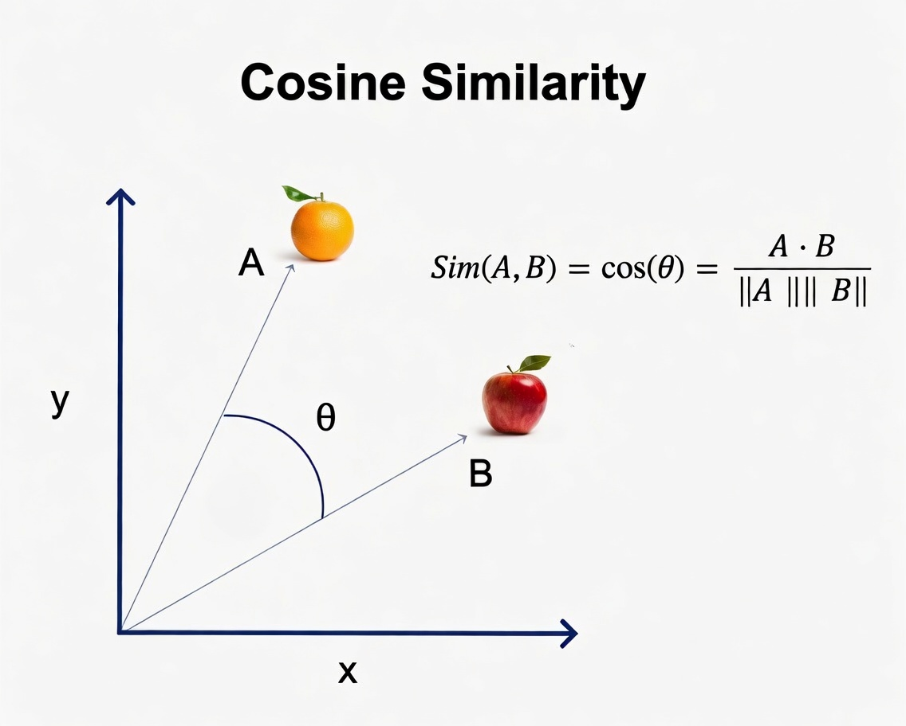
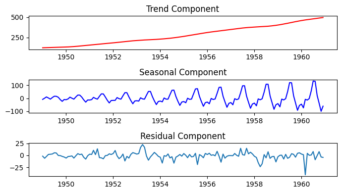
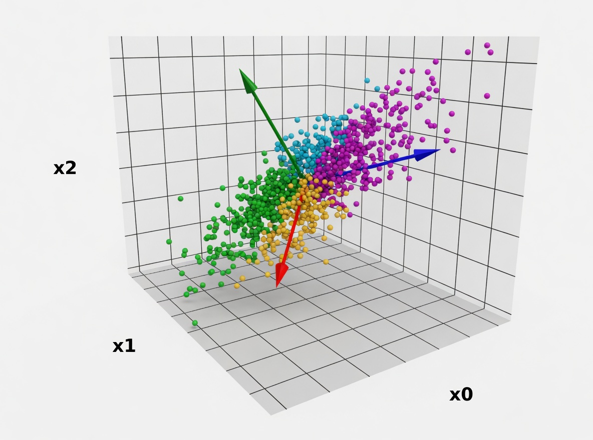
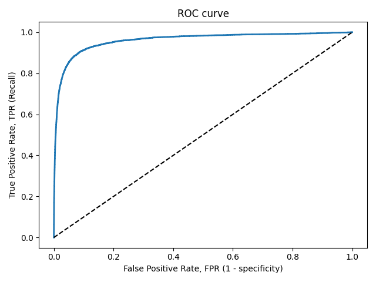
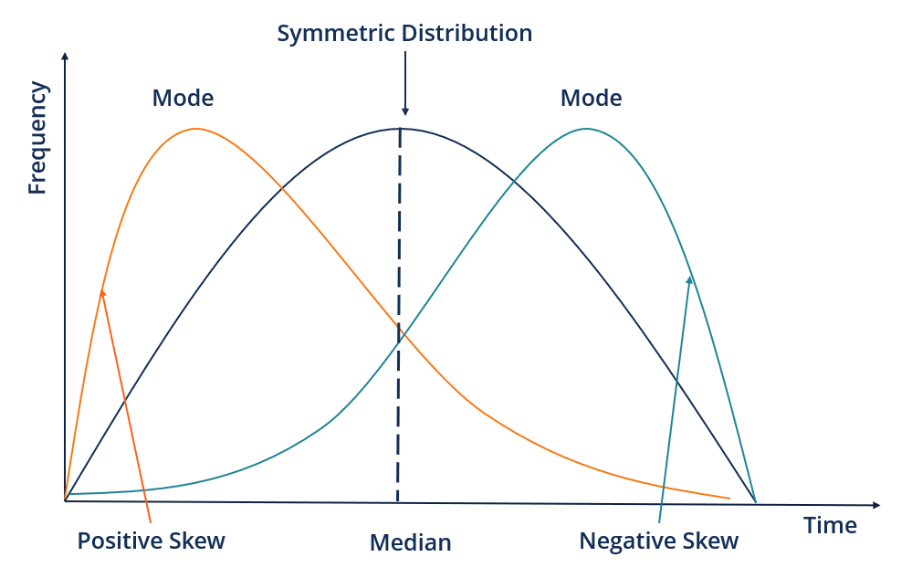
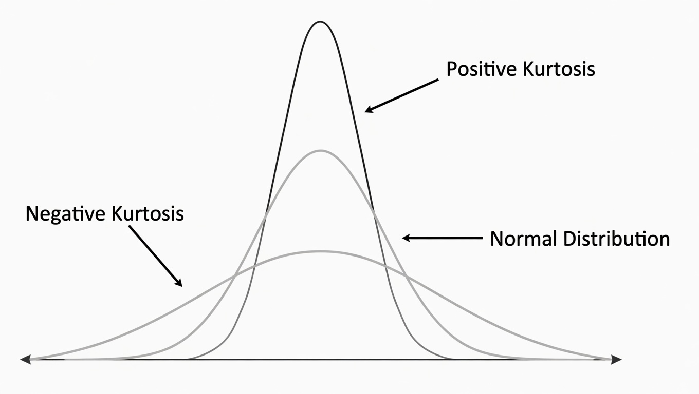

# Тезаурус курса «Анализ данных»

> **Автор:** Рубанов Михаил
> **Семестр:** весна 2026
> **Формат:** Obsidian vault (markdown с **wikilinks**)

---

## Структура

| Папка / файл | Что содержит |
|--------------|--------------|
| `README.md` | Этот файл — как читать |
| `00_index.md` | Алфавитный + тематический индекс всех терминов |
| `GRAPH.md` | Mermaid-граф связей (рендерится прямо на GitHub) |
| `topics/` | **11 тематических блоков** курса (по одному на каждое hw) |
| `terms/` | **49 карточек терминов** с определениями, формулами, кодом, плюсами/минусами |
| `images/` | Картинки, встраиваемые в карточки |
| `THESAURUS.html` | Стилизованный HTML всего тезауруса (для печати в PDF) |
| `THESAURUS_combined.md` | Единый markdown (для Obsidian → Export to PDF) |

## Как читать

Возможны два сценария:

1. **Освежить тему целиком** → открой соответствующий файл в `topics/`, оттуда ссылки приведут в `terms/`.
2. **Найти конкретный термин** → используй **index** или открой файл напрямую в `terms/`.

Связи внутри тезауруса оформлены как `**wikilink**`. В **Obsidian** по ним кликается; на GitHub — отображаются обычным текстом, но видно, что это перекрёстная ссылка.

### Граф связей

В Obsidian: `Ctrl+G` (Graph view). Каждый файл — узел, каждая ссылка — ребро. Видно, какие термины образуют «куст» (например, метрики классификации вокруг **Confusion-matrix**).

**На GitHub** Obsidian-граф напрямую не отображается, но есть три варианта:

1. **`GRAPH.md`** в корне vault'а — автоматически сгенерированный mermaid-граф связей. GitHub рендерит mermaid нативно, без настроек. Не интерактивный, но статичная картинка показывает всю структуру.
2. **Скриншот графа из Obsidian** — самый простой путь к красивой картинке. Откроем `Ctrl+G` → настраиваем фильтры/цвета → правый клик → Save as image.
3. **Quartz** ([quartz.jzhao.xyz](https://quartz.jzhao.xyz/)) — бесплатный генератор статичных сайтов из Obsidian-vault. Поддерживает **полностью интерактивный граф связей** в браузере, хостится на GitHub Pages бесплатно. Минимальная настройка: ставим Quartz, указываем папку с vault'ом, делаем `npm run build`, пушим в репу с GitHub Pages.

---

## Содержание курса

| № | Блок курса | Файл | Главные термины |
|---|------------|------|-----------------|
| 1 | Pandas | **01_pandas** | **Series**, **DataFrame**, **Groupby** |
| 2 | Очистка данных | **02_data_cleaning** | **Outliers**, **IQR**, **Z-score** |
| 3 | EDA | **03_eda** | **Correlation**, **Skewness-Kurtosis** |
| 4 | Визуализация и распределения | **04_visualization** | **Distributions**, **BG-NBD** |
| 5 | Динамическая визуализация и временные ряды | **05_dynamic_visualization** | **Moving-average**, **Decomposition**, **Cross-filtering**, **MASE** |
| 6 | Данные в ML | **06_ml_basics** | **Linear-regression**, **Logistic-regression**, **Random-Forest**, **CatBoost**, **K-Means**, метрики |
| 7 | Feature Importance | **07_feature_importance** | **Train-Valid-Test**, **Statistical-tests**, **Lasso** |
| 8 | Понижение размерности | **08_dim_reduction** | **PCA**, **t-SNE**, **UMAP** |
| 9 | Токенизация | **09_tokenization** | **BPE** |
| 10 | Эмбеддинги | **10_embeddings** | **BoW**, **TF-IDF**, **Word2Vec**, **GloVe**, **FastText** |
| 11 | Геоданные | **11_geo_data** | **Geopandas** |

---

## Сборка PDF

В корне vault'а лежат собранные файлы:

| Файл | Что |
|------|-----|
| `THESAURUS_combined.md` | Весь тезаурус в одном markdown |
| `THESAURUS.html` | Стилизованная HTML-версия с поддержкой формул (MathJax) |

### Способы получить PDF

1. **Из Obsidian** (рекомендуется): открыть `THESAURUS_combined.md` → `Ctrl+P` → команда **Export to PDF**.
2. **Из браузера**: открыть `THESAURUS.html` в Chrome / Edge → `Ctrl+P` → «Сохранить как PDF».
3. **Через pandoc** (если установлен):
   ```
   pandoc THESAURUS_combined.md -o THESAURUS.pdf --pdf-engine=xelatex
   ```


ewpage

# Алфавитный + тематический индекс

Все понятия курса в одном списке. Каждый термин — кликабельная ссылка на карточку.

## По темам курса

### hw1 — **Pandas**
- **Series**, **DataFrame**, **Groupby**

### hw2 — **Очистка данных**
- **Outliers**, **IQR**, **Z-score**

### hw3 — **EDA**
- **Correlation**, **Skewness-Kurtosis**

### hw4 — **Визуализация**
- **Distributions**, **BG-NBD**

### hw5 — **Динамическая визуализация**
- **Moving-average**, **Decomposition**, **Cross-filtering**, **MASE**

### hw6 — **ML основы**
- **Препроцессинг:** **One-hot-encoding**, **Ordinal-encoding**, **Normalization**, **Pipeline**, **Data-leakage**
- **Модели:** **Linear-regression**, **Logistic-regression**, **Random-Forest**, **CatBoost**, **K-Means**
- **Метрики регрессии:** **MAE**, **RMSE**, **R2**
- **Метрики классификации:** **Confusion-matrix**, **Precision-Recall**, **F1-score**, **ROC-AUC**
- **Метрика кластеризации:** **Silhouette**

### hw7 — **Feature Importance**
- **Train-Valid-Test**, **Statistical-tests**, **Feature-importance**, **Lasso**

### hw8 — **Понижение размерности**
- **PCA**, **t-SNE**, **UMAP**

### hw9 — **Токенизация**
- **BPE**

### hw10 — **Эмбеддинги**
- **Embedding**, **BoW**, **TF-IDF**, **Word2Vec**, **GloVe**, **FastText**, **Cosine-similarity**

### hw11 — **Геоданные**
- **Geopandas**

---

## Алфавитный индекс

### A — D
- **BG-NBD** — Beta-Geometric / NBD модель «жизни» пользователя (hw4)
- **BPE** — Byte-Pair Encoding, субсловная токенизация (hw9)
- **BoW** — Bag of Words, мешок слов (hw10)
- **CatBoost** — градиентный бустинг (hw6, hw7)
- **Confusion-matrix** — матрица ошибок (hw6)
- **Correlation** — корреляция Пирсона и Спирмена (hw3)
- **Cosine-similarity** — косинусное сходство (hw10)
- **Cross-filtering** — связанные интерактивные графики (hw5, hw11)
- **Data-leakage** — утечка данных (hw6, hw7)
- **DataFrame** — двумерная таблица pandas (hw1)
- **Decomposition** — декомпозиция временного ряда (hw5)
- **Distributions** — распределения в `scipy.stats` (hw4)

### E — K
- **Embedding** — векторное представление токенов (hw10)
- **F1-score** — баланс Precision и Recall (hw6)
- **FastText** — эмбеддинги через подслова (hw10)
- **Feature-importance** — важность признаков (hw7)
- **Geopandas** — работа с геоданными (hw11)
- **GloVe** — глобальные векторы (hw10)
- **Groupby** — агрегация по группам (hw1)
- **IQR** — межквартильный размах (hw2)
- **K-Means** — алгоритм кластеризации (hw6)

### L — P
- **Lasso** — L1-регуляризация (hw7, hw8)
- **Linear-regression** — линейная регрессия / SGDRegressor (hw6)
- **Logistic-regression** — логистическая регрессия (hw6, hw8, hw9, hw10)
- **MAE** — Mean Absolute Error (hw6)
- **MASE** — Mean Absolute Scaled Error (hw5 бонус)
- **Moving-average** — скользящее среднее (hw5)
- **Normalization** — нормализация / StandardScaler (hw6)
- **One-hot-encoding** — кодирование «один из N» (hw6)
- **Ordinal-encoding** — порядковое кодирование (hw6)
- **Outliers** — выбросы и аномалии (hw2)
- **PCA** — метод главных компонент (hw8)
- **Pipeline** — Pipeline и ColumnTransformer (hw6)
- **Precision-Recall** — точность и полнота (hw6)

### Q — Z
- **R2** — коэффициент детерминации (hw6)
- **Random-Forest** — случайный лес (hw6, hw7)
- **RMSE** — Root Mean Squared Error (hw6)
- **ROC-AUC** — площадь под ROC-кривой (hw9)
- **Series** — одномерный массив pandas (hw1)
- **Silhouette** — silhouette score (hw6)
- **Skewness-Kurtosis** — асимметрия и эксцесс (hw3)
- **Statistical-tests** — статистические тесты (hw7)
- **t-SNE** — нелинейное снижение размерности (hw8)
- **TF-IDF** — Term Frequency–IDF (hw10)
- **Tokenization** — токенизация текста (hw9)
- **Train-Valid-Test** — разбиение выборки (hw7)
- **UMAP** — нелинейное снижение размерности (hw8)
- **Word2Vec** — обучаемые эмбеддинги слов (hw10)
- **Z-score** — z-оценка / стандартизация (hw2)

---

## По типу понятия

### Метрики
- Регрессия: **MAE**, **RMSE**, **R2**
- Классификация: **Confusion-matrix**, **Precision-Recall**, **F1-score**, **ROC-AUC**
- Кластеризация: **Silhouette**
- Временные ряды: **MASE**

### Модели
- Регрессия: **Linear-regression**, **Random-Forest**, **CatBoost**
- Классификация: **Logistic-regression**, **Random-Forest**, **CatBoost**
- Кластеризация: **K-Means**
- Снижение размерности: **PCA**, **t-SNE**, **UMAP**

### Обработка данных
- **One-hot-encoding**, **Ordinal-encoding**, **Normalization**, **Pipeline**
- **Outliers**, **IQR**, **Z-score**
- **Train-Valid-Test**, **Data-leakage**

### Статистика
- **Distributions**, **Skewness-Kurtosis**, **Correlation**, **Statistical-tests**

### NLP
- **BPE**, **BoW**, **TF-IDF**
- **Embedding**, **Word2Vec**, **GloVe**, **FastText**, **Cosine-similarity**

### Временные ряды
- **Moving-average**, **Decomposition**

### Прочее
- **BG-NBD**, **Cross-filtering**, **Geopandas**
- **Feature-importance**, **Lasso**


# Часть I. Тематические блоки

# 01. Pandas — основа работы с табличными данными

> Библиотека для работы с табличными данными. Датасет курса: **Titanic** (`seaborn.load_dataset('titanic')`).

## Форматы файлов

| Формат | Метод pandas | Когда |
|--------|-------------|-------|
| **CSV** | `pd.read_csv()` | Стандартный обмен |
| **Excel** | `pd.read_excel()` | Бизнес-отчёты |
| **JSON** | `pd.read_json()` | API, вложенные структуры |
| Встроенные | `seaborn.load_dataset()` | Учебные датасеты |

## Структуры данных

| Структура | Что это | Аналогия |
|-----------|---------|----------|
| **Series** | Одномерный массив с именованными индексами | Один столбец Excel |
| **DataFrame** | Двумерная таблица из нескольких Series с общим индексом | Вся таблица Excel |

## Знакомство с данными

| Метод | Что показывает |
|-------|----------------|
| `.head(n)` | Первые `n` строк |
| `.info()` | Типы данных, число непустых значений |
| `.describe()` | Статистика по числовым столбцам (mean, std, min/max, квартили) |
| `.shape` | Размер `(строки, столбцы)` |
| `.columns` | Названия столбцов |

## Распределение значений

| Метод | Для чего |
|-------|---------|
| `.unique()` | Уникальные значения |
| `.nunique()` | Их количество |
| `.value_counts()` | Частота каждого значения |

## Фильтрация

| Способ | Пример |
|--------|--------|
| Логическая индексация | `df[df['age'] > 30]` |
| `.loc[]` | `df.loc[df['sex'] == 'female', ['age', 'fare']]` |
| Комбинация | `df[(df['age'] > 30) & (df['fare'] < 50)]` |

**UPD**: При комбинации условий **скобки вокруг каждого условия обязательны**.

## Создание новых столбцов

| Способ | Что делает |
|--------|------------|
| `df['new'] = ...` | Мутирует исходный DataFrame |
| `.assign(new=...)` | Возвращает новый DataFrame |
| `pd.concat([df, series], axis=1)` | Добавляет столбец из готового Series |

## **Агрегация**

| Функция | Что считает |
|---------|-------------|
| `.mean()`, `.median()` | Среднее, медиана |
| `.sum()` | Сумма |
| `.count()` | Число непустых |
| `.agg({'col1': 'mean', 'col2': 'sum'})` | Несколько функций сразу |

См. **Groupby**.

**После:** **02_data_cleaning**


# 02. Очистка и подготовка данных


## Четыре проблемы

| Проблема | Последствие |
|----------|-------------|
| **Пропуски** | Смещение средних, потеря наблюдений |
| **Дубликаты** | Завышенные частоты, искажённая статистика |
| **Аномалии (выбросы)** | Искажение корреляций, неработающие модели |
| **Несогласованный текст** | Невозможность группировки по категориям |

## Диагностика

| Проблема | Метод | Что ищем |
|----------|-------|----------|
| Пропуски | `.isna().sum()` | количество `NaN` по столбцам |
| Дубликаты | `.duplicated().sum()` | повторы строк |
| Аномалии | `.describe()` + визуализация | значения вне ожидаемого диапазона |
| Текст | `.value_counts()` | опечатки, регистр, лишние пробелы |

## Обработка дубликатов

`df.drop_duplicates()` — простой случай. Удалить полностью повторяющиеся строки.

## Обработка пропусков

Выбор стратегии зависит от **природы пропуска**:

| Стратегия | Когда |
|-----------|-------|
| Заполнить наиболее частым | Категории, где пропуск редко |
| Заполнить медианой по группе (`groupby` + `transform`) | Числовое, есть логическая группа (цена по стране) |
| Заполнить модой | Категория |
| Метка `"Unknown"` / `"Undefined"` | Пропуск сам по себе несёт смысл |
| Удалить строку | Пропусков очень мало |

**Важно**: Иногда пропуски замаскированы: вместо `NaN` — `0`, `-1`, или специальные строки.

## Обработка **аномалий**

**Природа выбросов:**
- Ошибка измерения/ввода (цена < 0) → удалить
- Редкое валидное наблюдение (винтажное вино за много денег) → сохранить или вынести в сегмент
- Систематическое искажение → исследовать источник

**Подходы к обнаружению:**

| Подход | Как | Когда |
|--------|-----|-------|
| Бизнес-логика | Экспертные границы (цена ≥ 0, возраст 0–120) | Есть доменные знания |
| Статистика — **IQR** | $[Q_1 - 1.5\,IQR;\ Q_3 + 1.5\,IQR]$ | Любые распределения |
| Статистика — **Z-score** | $\|z\| > 3$ | Близко к нормальному |

См. **Outliers**.

## Обработка текста

| Метод | Назначение |
|-------|------------|
| `.str.strip()` | Пробелы по краям |
| `.str.lower()` / `.str.title()` | Регистр |
| `.replace({...})` | Словарь замен (`'US' → 'United States'`) |
| `.str.contains('berry', case=False)` | Поиск подстроки |

**До:** **01_pandas** · **После:** **03_eda**

 
# 03. Разведочный анализ (EDA)

> **EDA (Exploratory Data Analysis)** — этап «знакомства» с данными через статистики и визуализацию.
> Датасеты: **diamonds** (теория) и **Palmer Penguins** (практика).

Ключевые вопросы:
- Как распределены значения признаков?
- Какие признаки связаны между собой?
- Какие закономерности скрыты в данных?
- Какие гипотезы можно сформулировать?

---

## Одномерный анализ

### Меры центральности

| Мера | Метод | Когда |
|------|-------|-------|
| Среднее | `.mean()` | Симметричное распределение без выбросов |
| Медиана | `.median()` | Асимметрия или выбросы |
| Мода | `.mode()` | Категориальные, мультимодальные |

**Важно**: Если `mean >> median` — асимметрия с правым хвостом → лучше брать устойчивую к выбросам **медиану**.

### Меры разброса и формы

| Статистика | Метод | Описание |
|------------|-------|----------|
| Дисперсия | `.var()` | $\sigma^2$ |
| Стд. отклонение | `.std()` | $\sigma$ |
| **IQR** | `Q3 − Q1` | Разброс центральных 50% |
| **Асимметрия** | `.skew()` | $>0$ — правый хвост, $<0$ — левый |
| **Эксцесс** | `.kurtosis()` | $>0$ — островершинное, $<0$ — плосковершинное |

### Графики

| График | Что показывает |
|--------|----------------|
| **Гистограмма** | Частота значений в интервалах |
| **KDE-plot** | Сглаженная оценка плотности |
| **Boxplot** | Медиана, квартили, выбросы |
| **Violinplot** | Boxplot + KDE |

---

## Двумерный анализ

> Корреляция ≠ причинно-следственная связь!

### Виды **корреляции**

| Тип | Когда |
|-----|-------|
| **Пирсона** (`.corr()`) | Линейная связь, нормальные данные |
| **Спирмена** (`.corr(method='spearman')`) | Монотонная связь, устойчива к выбросам |

### Графики

| График | Что показывает | Ограничения |
|--------|----------------|-------------|
| **Heatmap** | Матрица корреляций цветом | Не показывает форму связи |
| **Scatter plot** | Двумерное распределение точек | Только 2 признака + `hue` |
| **Pairplot** | Все попарные комбинации | Квадратичная сложность |

**Важно**: При анализе корреляций стоит смотреть по группам через `hue` — иначе можно увидеть отрицательную корреляцию там, где внутри классов она положительная (как в примере с пингвинами).

---

**До:** **02_data_cleaning** · **После:** **04_visualization**


# 04. Статическая визуализация и распределения

> Библиотеки: `matplotlib`, `seaborn`. На этом задании мы работали не с готовыми данными, а **моделировали распределения**. Бонусное задание — модель ****BG-NBD**** на датасете CDNOW.

## Чек-лист хорошего графика

- Понятно, что изображено
- Подписаны оси
- Есть легенда, если несколько серий

---

## Генерация случайных величин

Два подхода в Python:
- `numpy.random` — генерация напрямую
- **`scipy.stats`** — объект распределения (рекомендуется)

```python
from scipy import stats
xi = stats.norm(loc=0, scale=1)
samples = xi.rvs(size=1000)
xi.pdf(x) # плотность (для непрерывных)
xi.pmf(k) # вероятность (для дискретных)
xi.cdf(x) # функция распределения
xi.ppf(q) # квантиль (обратная CDF)
xi.mean(), xi.var()
```

**Важно**: В `Exp(λ)` параметр `scale = 1/λ`, а не `rate=λ`.

См. **Distributions**.

---

## Виды графиков для распределений

| Тип | Когда |
|-----|-------|
| **Гистограмма** (`plt.hist`) | Эмпирические данные |
| **Bar** (`plt.bar`) | Дискретные распределения (точное совпадение с целыми) |
| **plt.plot** | Непрерывные плотности, теоретические кривые |
| **plt.plot('o-')** | Дискретные `pmf` поверх гистограммы |

Параметры:
- `density=True` — нормировать гистограмму так, чтобы площадь = 1
- `bins=range(...)` — для дискретных
- `alpha` — прозрачность

---

## Сглаживание (KDE)

```python
from scipy.stats import gaussian_kde
kde = gaussian_kde(data, bw_method='scott') # или 'silverman', или число
```

- Маленький `bw_method` → рваная кривая (шум)
- Большой → слишком гладко (теряются детали)

**Важно**: KDE может **создать иллюзию непрерывности** для дискретных данных, исказив их изначальный смысл.

---

## Сетка графиков

```python
fig, axes = plt.subplots(nrows=2, ncols=3, figsize=(15, 8),
 sharex=True, sharey=False)
axes_flat = axes.flatten()
```

## Элементы оформления

| Метод | Зачем |
|-------|-------|
| `ax.annotate(...)` | Аннотации со стрелками |
| `ax.text(..., bbox=...)` | Текстовые блоки с фоном |
| `ax.axvline()`, `ax.axhline()` | Вертикальные/горизонтальные линии |
| `ax.fill_between()`, `ax.axvspan()` | Заливка областей |

---

## Смеси распределений

Загрязнённое нормальное распределение (есть основная группа и активное меньшинство):

$$f(x) = (1-\varepsilon)\,\mathcal{N}(\mu,\sigma^2) + \varepsilon\,\mathcal{N}(\mu, \alpha\sigma^2)$$

При $\alpha > 1$ — у смеси «тяжёлые хвосты», которых нет у чистого нормального.

Бимодальность гистограммы часто = смесь компонент (например, длина клюва пингвинов — смесь по видам).

---


## **BG-NBD** — модель Buy Till You Die

Бизнес-модель оттока клиентов:
- Покупки на пользователя ~ геометрическое
- Время между покупками ~ экспоненциальное
- Параметры варьируются: $p \sim \text{Beta}$, $\lambda \sim \text{Gamma}$

Подробнее → **BG-NBD**.

---

**До:** **03_eda** · **После:** **05_dynamic_visualization**


# 05. Динамическая визуализация и временные ряды

> Библиотеки: **plotly** , **bokeh** .
> Датасет курса: финансовые данные **AAPL, GOOGL, MSFT, AMZN, TSLA, ^GSPC** за 2021–2024.

**Важно**: GitHub **не отображает** интерактивные графики. Нужно сохранять в формате HTML: `fig.write_html("plot.html")` + скрины в README.

## Когда использовать

- Дашборды для бизнес-пользователей
- EDA для внешних пользователей
- Презентации с глубоким погружением
- Веб-публикации

---

## Plotly — основные виды графиков

| График | Для чего |
|--------|----------|
| **Candlestick** | цены акций/аблигаций и тд |
| **Scatter** | Линии, точки (`mode='lines'/'markers'/'lines+markers'`) |
| **Bar** | Столбчатые (объём торгов) |

```python
import plotly.graph_objects as go
from plotly.subplots import make_subplots

fig = make_subplots(rows=2, cols=1, shared_xaxes=True,
 row_heights=[0.7, 0.3])
fig.add_trace(go.Candlestick(x=df.Date, open=df.Open, high=df.High,
 low=df.Low, close=df.Close), row=1, col=1)
fig.add_trace(go.Bar(x=df.Date, y=df.Volume), row=2, col=1)
fig.write_html("dashboard.html")
```

### Интерактивные элементы

| Возможность | Метод |
|-------------|-------|
| **Range Slider** | `update_xaxes(rangeslider=...)` |
| **Range Selector** (кнопки 1M/3M/6M/1Y/All) | `update_xaxes(rangeselector=...)` |
| **Hover** | `update_layout(hovermode=...)` |
| **Аннотации** | `fig.add_annotation(...)` |

---

## **Cross-filtering**

Когда взаимодействие с одним графиком обновляет другие.

| Тип | Что делает |
|-----|------------|
| **Shared Axes** | Общая ось X/Y, общий zoom |
| **Legend Toggle** | Клик по легенде → показать/скрыть серию |
| **Brushing** | Выделение области → фильтр |
| **Click Events** | Клик по точке → действие |
| **Dropdown (updatemenus)** | Выбор в меню → обновление |

См. **Cross-filtering**.

---

## Bokeh — кратко

| Функционал | Метод |
|-----------|-------|
| `figure()` | Создаёт холст |
| Glyphs | `line()`, `circle()`, `bar()` |
| `ColumnDataSource` | Источник данных |
| Widgets | `Select()`, `Slider()`, `CheckboxGroup()` |
| Callbacks | `js_on_change()`, `on_change()` |
| Layouts | `column()`, `row()`, `gridplot()` |

---

## Временные ряды

### **Скользящее среднее (SMA)**

$$SMA_t = \frac{1}{n}\sum_{i=0}^{n-1} p_{t-i}$$

```python
df['MA20'] = df['Close'].rolling(window=20).mean()
```

- **MA5** — краткосрочный сигнал, быстро реагирует
- **MA20** — общий тренд, сглаживает шум

### **Декомпозиция**

$$y_t = \text{Trend}_t + \text{Seasonality}_t + \text{Residual}_t$$

```python
from statsmodels.tsa.seasonal import seasonal_decompose, STL
result = seasonal_decompose(df['Close'], model='additive', period=251)
# STL — более «умная», устойчивая
stl = STL(df['Close'], period=251).fit()
```
Декомпозиция **позволяет** разбить временной ряд на **тренд** (общую тенденцию изменений при продолжительном времени), **сезонность** (повторяющиеся с фиксированным периодом изменения) и **случайный шум**

---

**До:** **04_visualization** · **После:** **06_ml_basics**


# 06. Данные в машинном обучении

> Три типа задач: **регрессия**, **классификация**, **кластеризация**. Цель — понять, как данные влияют на предсказание.

## Типы задач

| Тип | Что предсказываем | Датасет в курсе | Модели в курсе | Метрики |
|-----|-------------------|-----------------|----------------|---------|
| **Регрессия** | Непрерывная величина | `diamonds` | `SGDRegressor`, `RandomForestRegressor` | **MAE**, **RMSE**, **R2** |
| **Классификация** | Класс | `Telco-Customer-Churn` | **Logistic-regression**, **Random-Forest**, **CatBoost** | **Precision-Recall**, **F1-score**, **ROC-AUC** |
| **Кластеризация** | Скрытые группы (unsupervised) | `Mall_Customers` | **K-Means** | **Silhouette**, inertia |

---

## Подготовка категориальных признаков

| Метод | Когда |
|-------|-------|
| **One-hot-encoding** | Категории **без** порядка (color, country) |
| **Ordinal-encoding** | Категории **с** порядком (clarity, cut) |

**Важно**: Применить ordinal к не-упорядоченным → модель «увидит» искусственный порядок, что испортит обучение.
**Важно**: `handle_unknown` — для категорий, которых не было в train.

---

## **Нормализация**

`StandardScaler`: $(x - \mu) / \sigma$ → среднее 0, std 1.

Зачем для линейных моделей:
1. Градиентный спуск работает быстрее
2. Коэффициенты становятся сравнимыми
3. Регуляризация работает корректно

- Для **K-Means** и алгоритмов на **расстояниях** — обязательна, иначе признак с большим масштабом доминирует.
- Для деревьев и бустингов — не нужна (они инвариантны к скейлингу).

---

## **Pipeline**

Контейнер шагов: препроцессоры + модель в одном объекте.

```python
from sklearn.pipeline import Pipeline
from sklearn.compose import ColumnTransformer

preproc = ColumnTransformer([
 ('num', StandardScaler(), num_cols),
 ('ord', OrdinalEncoder(), ord_cols),
 ('ohe', OneHotEncoder(handle_unknown='ignore'), nom_cols),
])
pipe = Pipeline([('prep', preproc), ('model', SGDRegressor())])
pipe.fit(X_train, y_train)
```

**Важно**: **`fit()` только на train**, к test — `transform()` с теми же параметрами. Иначе → **Data-leakage**.

---

## Метрики

### Регрессия
- **MAE** — средняя абсолютная ошибка
- **RMSE** — корень из MSE, сильнее штрафует большие отклонения
- **R2** — доля дисперсии, объяснённая моделью

### Классификация
- **Accuracy**:
	 -`Accuracy=(TP+TN)/(TP+TN+FP+FN)`— бесполезна при дисбалансе классов
- **Confusion-matrix** — матрица, состоящая из TN / FP / FN / TP
- **Precision-Recall**:
 - `Precision = TP/(TP+FP)` — когда дороги ложные срабатывания
 - `Recall = TP/(TP+FN)` — когда дорог пропуск
- **F1-score** — гармоническое среднее между `Precision` и `Recall`
- **ROC-AUC** — устойчива к дисбалансу

### Кластеризация
- **Silhouette** — насколько объект «свой» в своём кластере
- `inertia_` — сумма квадратов расстояний до центроида (метод локтя)

---

## Дисбаланс классов и порог

При дисбалансе:
- `class_weight='balanced'` — обратные веса по частоте
- Подбор **порога классификации** (по умолчанию 0.5) под бизнес-задачу

---

**До:** **05_dynamic_visualization** · **После:** **07_feature_importance**


# 07. Feature Engineering и важность признаков

> Цель: подготовить признаки так, чтобы **простая модель** работала хорошо.
> Датасеты курса: **Medical Insurance Cost** (теория, регрессия) и **Wine Quality** (практика, многоклассовая классификация).

---

## **Разбиение train / valid / test**

| Выборка | Функция | Доля (типично) |
|---------|---------|----------------|
| **Train** | Обучение модели | 60–70% |
| **Valid** | Подбор гиперпараметров, настройка | 10–20% |
| **Test** | Финальная независимая оценка | 15–20% |

**Важно**: Test трогаем **один раз в конце**. Иначе → **Data-leakage**.

`stratify` в `train_test_split` — сохраняет доли категориального признака.

После разбиения — проверить, что распределения совпадают, через **статтесты**.

---

## **Статистическое тестирование признаков**

### Числовые признаки

| Метод | Что показывает |
|-------|----------------|
| **Корреляция Пирсона** (`stats.pearsonr`) | Линейная связь |
| **Корреляция Спирмена** (`stats.spearmanr`) | Монотонная связь |
| t-test (`stats.ttest_ind`) | Различаются ли средние |
| ANOVA (`stats.f_oneway`) | Различаются ли средние нескольких групп |

### Категориальные признаки

| Метод | Что показывает |
|-------|----------------|
| Хи-квадрат (`stats.chi2_contingency`) | Зависимость между признаками |
| Cramér's V | Сила связи (через χ²) |
| t-test / ANOVA | Влияет ли категория на числовой таргет |

См. **Statistical-tests**.

---

## Создание новых признаков

| Тип | Примеры из курса |
|-----|------------------|
| **Монотонные преобразования** | `log(x)`, `exp(x)`, `x^k`, `√x` — для скошенных распределений |
| **Агрегации / биннинг** | `age_category`, `weight_category` (BMI) — доменные категории |
| **Комбинации признаков** | `age * bmi`, `age / bmi`, `age_bmi_children` |
| **Отношения** | `chlorides/sugar`, `citric_acid/density` |
| **Индикаторы** | Бинарные признаки наличия / превышения порога |

---

## Важность признаков через модели

| Способ | Где |
|--------|-----|
| `coef_` | **Linear-regression**, **Logistic-regression** (требует **Normalization**) |
| **Lasso** (L1-регуляризация) | Зануляет неважные признаки |
| `feature_importances_` | **Random-Forest**, **CatBoost** — через разбиения |

**Важно**: Важность признаков **зависит от модели**: для линейной важно одно, для деревьев — другое.

См. **Feature-importance**.

---

## Алгоритм работы

1. Найти **статистически значимые** признаки
2. Обучить модель → получить **практическую значимость**
3. **Поменять набор**: удалить слабые, добавить новые
4. Перепроверить метрику на valid

**Важно**: Не используй валидацию на test — только на valid.

---

**До:** **06_ml_basics** · **После:** **08_dim_reduction**


# 08. Понижение размерности

> Зачем: борьба с **проклятием размерности**, визуализация в 2D/3D, ускорение моделей.
> Датасеты курса: **MNIST** (картинки 28×28 = 784 признака) и **Wine Quality** (табличные).

## Проклятие размерности

Когда количество признаков $D$ сравнимо с количеством объектов $n$ или превышает его:
- Изображение 28×28 = 784 признака
- Текст после векторизации = тысячи признаков
- Генетические данные = десятки тысяч признаков

Проблемы: вычислительная сложность, переобучение, расстояния теряют смысл, алгоритмы на расстояниях работают хуже (Проклятие размерности).

---

## Сравнение методов

| Метод | Тип | Сохраняет | Когда |
|-------|-----|-----------|-------|
| **PCA** | Линейный | Глобальную дисперсию | Препроцессинг, табличные данные |
| **t-SNE** | Нелинейный | Локальную структуру (кластеры) | Визуализация |
| **UMAP** | Нелинейный | Локальную + глобальную | Большие данные, визуализация |

---

## **PCA** кратко

Линейная проекция в направления **максимальной дисперсии**.

$$Y = XW, \quad \max_{W:\,W^\top W = I} \text{Tr}(W^\top \Sigma W)$$

Столбцы $W$ — собственные векторы ковариационной матрицы $\Sigma$, отсортированные по убыванию собственных значений.

**Доля объяснённой дисперсии**: первые $k$ компонент могут объяснять, например, 85% дисперсии данных.

**Важно**: Перед PCA — **обязательная** **стандартизация**.

Это алгоритм **обучения без учителя**.

---

## **t-SNE** кратко

**Идея:** сохранить «близких соседей» в исходном и low-dim пространстве.

В исходном:
$$p_{j|i} = \frac{\exp(-\|x_i - x_j\|^2 / 2\sigma_i^2)}{\sum_{k \neq i} \exp(-\|x_i - x_k\|^2 / 2\sigma_i^2)}$$

В low-dim (t-распределение Стьюдента с 1 степенью свободы):
$$q_{ij} = \frac{(1 + \|y_i - y_j\|^2)^{-1}}{\sum_{k \neq l}(1 + \|y_k - y_l\|^2)^{-1}}$$

**Оптимизация:** минимизация KL-дивергенции $KL(P\|Q)$.

Параметр **`perplexity`** ≈ ожидаемое число соседей (обычно 5–50).

---

## **UMAP** кратко

Аппроксимация многообразия с сохранением **локальной и глобальной** структуры.
1. Предположение: данные на римановом многообразии
2. Строится взвешенный граф соседства
3. Оптимизируется расположение в low-dim для сохранения графа

```python
umap.UMAP(n_components=2, n_neighbors=15, min_dist=0.1, metric='euclidean')
```

---

## PCA vs Lasso как отбор признаков

| | PCA | Lasso |
|--|-----|-------|
| Что делает | Создаёт **новые** линейные комбинации | Выбирает подмножество **исходных** признаков |
| Интерпретация | Сложнее (компоненты = смесь) | Проще (видны конкретные признаки) |
| Зависит от таргета | Нет (unsupervised) | Да (supervised) |

---

**До:** **07_feature_importance** · **После:** **09_tokenization**


# 09. Токенизация

> **Токенизация** — разбиение текста на минимальные единицы (токены).
> Датасет курса: **100k YouTube comments** (sentiment dataset).
> Задача: бинарная классификация на positive/negative.

## Три уровня

| Уровень | Пример | Плюсы | Минусы |
|---------|--------|-------|--------|
| **Word** | `"I love NLP"` → `["I", "love", "NLP"]` | Сохраняет смысл слова | Большой словарь, OOV |
| **Char** | `"NLP"` → `["N", "L", "P"]` | Маленький словарь, любая опечатка ок | Длинные последовательности |
| **Subword (**BPE**)** | `"unbelievable"` → `["un", "believ", "able"]` | Компромисс | — |

**Важно**: **OOV (Out-of-Vocabulary)** — слова, которых не было в train. Для word — фатально, для char/BPE — нет.

---

## Word-level

```python
from nltk.tokenize import WordPunctTokenizer
tok = WordPunctTokenizer()
tokens = tok.tokenize(text.lower()) # приводим к нижнему регистру
```

Для классификации тональности обычно достаточно word.

## Char-level

```python
tokens = list(text)
```

**Важно**: К нижнему регистру **не приводим** — иначе теряем информацию.

## **Byte-Pair Encoding**

Алгоритм субсловной токенизации:
1. Старт: посимвольное разбиение
2. Итеративно объединять **самые частые пары** токенов
3. Останавливаться при достижении нужного размера словаря

См. **BPE**.

---

## Сравнение

| Свойство | Word | Char | BPE |
|----------|------|------|-----|
| Размер словаря | Большой | Маленький | Управляемый |
| Длина seq | Короткая | Очень длинная | Средняя |
| OOV | Да | Нет | Почти нет |

---

## Признаки на основе токенов

После токенизации:

1. **Топ-10 частых токенов** — общий обзор
2. **Топ-N токенов с разной частотой по классам** — гораздо лучше для классификации, чем просто «топ»
3. Преобразовать тексты в **таблицы 0/1**: встречается ли токен в строке

Затем — обучить простую модель (**Logistic-regression**) и смотреть метрику **ROC-AUC**.

---

**До:** **08_dim_reduction** · **После:** **10_embeddings**


# 10. Эмбеддинги

> **Эмбеддинг** — векторное представление токена в $\mathbb{R}^d$. Близость векторов = смысловая близость.
> Датасет курса: тот же **YouTube comments**. Задача: классификация тональности + поиск похожих предложений.

## Два семейства

| Семейство | Идея | Примеры |
|-----------|------|---------|
| **Count-based** | Подсчитываем статистики, строим векторы | **BoW**, **TF-IDF** |
| **Learned (обучаемые)** | Нейросеть учит векторы на задаче | **Word2Vec**, **GloVe**, **FastText** |

---

## **Bag of Words**

Каждый документ — вектор **счётчиков слов** из словаря.

**Важно**: Игнорирует порядок и семантику.

## **TF-IDF**

$$\text{feature}_i = \frac{\text{Count}(w_i \in x)}{|x|} \cdot \log\frac{N}{\text{Count}(w_i \in D) + \alpha}$$

- **TF** — частота в документе
- **IDF** — обратная частота по корпусу (редкие слова — больший вес)
- $\alpha$ — сглаживание

Опять без семантики, но лучше **BoW** для большинства задач.

---

## Обучаемые эмбеддинги

| Метод | Особенность |
|-------|-------------|
| **Word2Vec** | Учится через предсказание контекста; знаменитое `king − man + woman ≈ queen` |
| **GloVe** | Учит векторы на матрице совместной встречаемости (другая целевая функция) |
| **FastText** | Вектор слова = сумма векторов **подслов** → решает OOV-проблему |

В `gensim` можно как **обучить** свою модель, так и использовать **предобученную** (`gensim.downloader.load(...)`).

**Важно**: На маленьком корпусе собственно обученные векторы — шумные. Предобученные модели на больших корпусах дают качественнее результат.

---

## Использование

### 1. Признаки для классификации
```python
X = np.array([sentence_to_vector(s) for s in texts])
LogisticRegression().fit(X, y)
```

**Результаты в hw10:**
- **BoW** / **TF-IDF** — хорошие, но без семантики
- **FastText** — лучше, потому что учитывает семантический смысл

### 2. Поиск похожих предложений по **косинусному расстоянию**
$$\cos(\theta) = \frac{u \cdot v}{\|u\|\,\|v\|}$$

См. **Cosine-similarity**.

### 3. Визуализация
**PCA** (линейная) и **t-SNE** (нелинейная) — в 2D, смотрим группы слов.

---

**До:** **09_tokenization** · **После:** **11_geo_data**


# 11. Геоданные

> Упор на **визуализацию и бизнесовую интерпретацию**.
> Датасет курса: **NYC Yellow Taxi** (поездки за 1 день марта 2016) + **Borough Boundaries NYC** (полигоны районов).

## Что нового

| Понятие | Что это |
|---------|---------|
| **Геоданные** | Табличные данные + столбец `geometry` (точки, полигоны) |
| **`geopandas`** | Расширение pandas: GeoDataFrame с геометрией |
| **GeoJSON / shape-файлы** | Форматы для хранения границ |

См. **Geopandas**.

---

## Расстояния

**Важно**: Евклидово расстояние **некорректно** для координат — Земля не плоская. 
Поэтому нужно **геодезическое расстояние**

```python
from geopy.distance import geodesic
distance_miles = geodesic((lat1, lon1), (lat2, lon2)).miles
```

---


## Типичные выводы

- **Дистанция такси > евклидовой** (улицы, пробки)
- **Кластеры pickup** — деловые районы, вокзалы, аэропорты
- **Часовые паттерны** — пики утром/вечером
- **Цена в районах с аэропортами** выше — длинные маршруты + фиксированные тарифы

---

**До:** **10_embeddings**


# Часть II. Карточки терминов

# BG/NBD — Beta-Geometric / Negative Binomial Distribution

## Определение

**BG/NBD (Buy Till You Die)** — вероятностная модель поведения покупателей.
Изучалась на датасете **CDNOW** (онлайн-покупки музыки 1997–98 гг.).

## Предположения модели

Для каждого пользователя:

1. После каждой покупки с вероятностью $p$ пользователь **уходит** («умирает»), с вероятностью $1-p$ остаётся.
2. Если остался, **следующая покупка** случится через время $T \sim \text{Exp}(\lambda)$.
3. **Количество покупок до смерти** ~ $\text{Geom}(p)$.
4. Параметры **варьируются по популяции**:
 - $p \sim \text{Beta}(\alpha_p, \beta_p)$
 - $\lambda \sim \text{Gamma}(\alpha_\lambda, \beta_\lambda)$

## Ключевая формула

**Вероятность того, что пользователь жив**, если не было активности время $t$:

$$P(\text{alive} \mid T > t) = \frac{e^{-\lambda t}(1-p)}{e^{-\lambda t}(1-p) + p}$$

### Вывод (через формулу Байеса)

Пусть $\xi \sim B(1-p)$ — пользователь жив. Тогда:
- $P(T > t \mid \xi=1) = e^{-\lambda t}$ (жив → ждём по экспоненте)
- $P(T > t \mid \xi=0) = 1$ (мёртв → активности уже не будет)

$$P(\xi=1 \mid T > t) = \frac{P(T > t \mid \xi=1)\, P(\xi=1)}{P(T > t \mid \xi=0)\, P(\xi=0) + P(T > t \mid \xi=1)\, P(\xi=1)}$$

Подставляя:
$$= \frac{e^{-\lambda t}(1-p)}{p + e^{-\lambda t}(1-p)}$$

## Что считает модель

| Величина | Смысл |
|----------|-------|
| Кривая выживания $S(t) = P(T > t)$ | Вероятность того, что клиент ещё «жив» |
| Кривая риска $h(t) = 1 - S(t)$ | Вероятность «смерти» к моменту $t$ |
| $\mathbb{E}[X(t)]$ | Ожидаемое число покупок за следующие $t$ дней |

## Бизнес-применение

- Расчёт **CLV** (Customer Lifetime Value)
- Прогноз оттока
- Сегментация: live / at-risk / dead

**Тема:** **04_visualization**


---

# BPE — Byte-Pair Encoding

## Что это

Алгоритм **субсловной** токенизации. Строит словарь итеративно: начинает с символов и сливает самую частую пару в новый токен, пока не достигнет нужного `vocab_size`.

## Алгоритм

1. **Старт**: посимвольное разбиение
2. Находим самую частую **пару соседних токенов** в корпусе
3. Объединяем эту пару в новый токен, добавляем в словарь
4. Повторяем до нужного размера словаря

Пример: слово `unbelievable` может разбиться на `["un", "believ", "able"]`.

## Свойства

- **Частые слова** → один токен
- **Редкие или новые** → дробятся на куски
- Решает **OOV**-проблему
- Управляемый размер словаря

## Сравнение с другими токенизациями

| Свойство | Word | Char | **BPE** |
|----------|------|------|---------|
| Словарь | Большой | Маленький | **Управляемый** |
| Длина seq | Короткая | Очень длинная | **Средняя** |
| OOV | Да | Нет | **Почти нет** |

В лабе по токенизации реализовывал BPE сам (упрощённую версию). Из всех трёх токенизаций именно BPE получился оптимальным — словарь не слишком большой, длина предложений ненамного больше, чем у Word.

**Тема:** **09_tokenization**


---

# BoW — Bag of Words

## Что это

Простейший способ представить текст как вектор. Каждый документ — это **вектор счётчиков** слов из общего словаря.

## Алгоритм

1. Составляем **словарь** часто встречающихся слов по обучающей выборке
2. Для каждого документа считаем, сколько раз встречается каждое слово из словаря
3. Эти счётчики — признаки для классификатора

Пример: словарь `["love", "data", "model", "bad"]`

| Текст | love | data | model | bad |
|-------|------|------|-------|-----|
| `"I love data"` | 1 | 1 | 0 | 0 |
| `"data data model"` | 0 | 2 | 1 | 0 |

## Плюсы и минусы

- Простой, быстрый, интерпретируемый
- Норм бейзлайн для классификации текста
- Игнорирует **порядок** слов — «собака укусила человека» = «человек укусил собаку»
- Не учитывает **семантику** — `"good"` и `"great"` для модели разные токены
- Все слова равноценны — никакой «информативности»

## Что показал в курсе

На классификации YouTube-комментариев BoW дал нормальные метрики, но проиграл **FastText** — потому что не учитывает семантику. **TF-IDF** в этой же задаче работал чуть хуже BoW, что неожиданно.

| Метод | Семантика |
|-------|-----------|
| BoW | только синтаксис (частоты) |
| **TF-IDF** | но хотя бы взвешивает по редкости |
| **FastText** | учитывает смысл |

**Тема:** **10_embeddings**


---

# CatBoost

## Что это

Реализация **градиентного бустинга** на деревьях от Яндекса. Деревья обучаются **последовательно** — каждое следующее исправляет ошибки предыдущих.

Главная фишка — встроенная обработка **категориальных признаков**, можно скармливать строки напрямую без явного **OHE** / **Ordinal**.

## Плюсы

- Часто **лучшее качество «из коробки»** среди классических моделей
- Категории сам обработает, не надо городить пайплайн
- **Normalization** не нужна
- Поддержка `early_stopping`, `eval_set` — удобно следить за переобучением

## Где использовался

Одна из трёх моделей на Telco-Churn (вместе с лог. регрессией и Random Forest) и для сравнения важности признаков на Medical Insurance.

**Тема:** **06_ml_basics**


---

# Confusion Matrix — матрица ошибок

## Что это

Таблица 2×2 для бинарной классификации, на которой держатся все нормальные метрики:

| | Предсказано 0 | Предсказано 1 |
|---|---------------|---------------|
| **Реально 0** | **TN** (True Negative) | **FP** (False Positive, ошибка I рода) |
| **Реально 1** | **FN** (False Negative, ошибка II рода) | **TP** (True Positive) |

## Какие метрики из неё получаются

| Метрика | Формула | Смысл |
|---------|---------|-------|
| Accuracy | $(TP + TN)/\text{всё}$ | Доля правильных |
| Precision | $TP / (TP + FP)$ | Из предсказанных «1» — сколько реально «1» |
| Recall | $TP / (TP + FN)$ | Из реальных «1» — сколько мы нашли |
| F1 | $2 \cdot \frac{\text{Prec} \cdot \text{Rec}}{\text{Prec} + \text{Rec}}$ | Баланс |

Подробнее: **Precision-Recall**, **F1-score**.

## Почему accuracy не работает при дисбалансе

Если 99% клиентов не уходят, модель «всегда No» получит **accuracy 99%**, но толку от неё ноль — мы ни одного уходящего не задетектим.

## Ошибки I и II рода

- **I рода (FP)** — «ложная тревога»: сказали «болен», а здоров
- **II рода (FN)** — «пропуск»: сказали «здоров», а болен

В задаче про отток клиентов хуже **FN** — упускаем уходящего клиента, и его уже не вернуть.

**Тема:** **06_ml_basics**


---

# Корреляция

## Что это

Мера связи между двумя числовыми переменными, значения в `[-1, 1]`:
- `1` — идеальная положительная связь
- `-1` — идеальная отрицательная
- `0` — связи нет (по крайней мере линейной/монотонной)

**Важно**: корреляция ≠ причинно-следственная связь!

## Два вида в курсе

### Пирсона
Измеряет **линейную** связь. `df.corr()` (по умолчанию), `stats.pearsonr(x, y)`. Чувствительна к выбросам.

### Спирмена
Корреляция **рангов** — измеряет монотонную (не обязательно линейную) связь. `df.corr(method='spearman')`. Устойчива к выбросам.

## Когда какую брать

| Ситуация | Метрика |
|----------|---------|
| Линейная связь, нормальные данные | Пирсон |
| Монотонная, но не обязательно линейная | Спирмен |
| Есть выбросы | Спирмен |

**Важно**: если коэффициенты Пирсона и Спирмена близки — связь скорее линейная. Если Пирсон сильно меньше Спирмена — связь нелинейная, но монотонная.

## Графики для просмотра

| График | Что показывает |
|--------|----------------|
| **Heatmap** | Матрица корреляций цветом |
| **Scatter** | Форма связи между двумя признаками |
| **Pairplot** | Все попарные комбинации |

## Подводный камень — корреляции по группам

На Palmer Penguins обнаружил такую штуку: глубина и длина клюва имеют **отрицательную** корреляцию по всей выборке, но **положительную** внутри каждого вида отдельно. Сдвиг видов «портит» общую корреляцию.

Поэтому всегда стоит проверять корреляции **и по группам** — через `hue` в scatter.

## Мультиколлинеарность

Если несколько признаков сильно коррелируют между собой, лин. регрессия начинает давать нестабильные коэффициенты. Что с этим делать:
- Убрать один из коррелированных вручную
- Применить **PCA** для понижения размерности
- Использовать **Lasso** для отбора признаков

**Тема:** **03_eda**


---

# Косинусное расстояние (сходство)

## Что это

Мера близости двух векторов через косинус угла между ними:

$$\cos(\theta) = \frac{u \cdot v}{\|u\|\,\|v\|}$$



| Значение | Смысл |
|----------|-------|
| `1` | Векторы сонаправлены (≈ одинаковый смысл) |
| `0` | Перпендикулярны (не связаны) |
| `−1` | Противоположны по направлению |

Косинусное **расстояние** = `1 − cos(θ)`.

## Где использовали

В курсе использовали для **поиска похожих по смыслу предложений**:

1. Каждое предложение → вектор (через **BoW** / **TF-IDF** / **FastText**)
2. Запрос → вектор тем же методом
3. Сортируем предложения по cos-сходству, берём топ-K

## Косинусное vs евклидово

- **Косинусное** — когда важно **направление** вектора, а не его длина (тексты, эмбеддинги)
- **Евклидово** — когда важна абсолютная разница в значениях (физические измерения)

**Тема:** **10_embeddings**


---

# Cross-filtering

## Что это

Техника, при которой взаимодействие с одним графиком **автоматически обновляет** другие графики в дашборде. По сути основа интерактивных дашбордов в plotly / bokeh.

## Типы связей

| Тип | Что делает |
|-----|------------|
| **Shared Axes** | Общая ось X/Y, общий zoom |
| **Legend Toggle** | Клик по легенде → показать/скрыть серию во всех графиках |
| **Brushing** | Выделение области → фильтр других графиков |
| **Click Events** | Клик по точке → дополнительная информация |
| **Dropdown (`updatemenus`)** | Выбор в меню → обновление графиков |

## GitHub и интерактивность

GitHub **не отображает** интерактивные графики в превью ноутбука. Поэтому для дашбордов надо отдельно сохранять `fig.write_html("dashboard.html")` и прикладывать к репе скриншоты.

**Тема:** **05_dynamic_visualization**


---

# Data Leakage (утечка данных)

## Что это

Ситуация, когда модель при обучении получает информацию из тестовой выборки или из «будущего», которой в реальном применении у неё не будет. Метрика на тесте получается **завышенной**, а в продакшене модель сваливается.


## Главное правило

> **Все трансформы и статистики считаем только по train, к test применяем с теми же параметрами.**

## Типичные грабли

- **Препроцессинг по всему датасету** — `StandardScaler().fit(X_all)` вместо `.fit(X_train)`. Статистики «знают» про test.
- **Заполнение пропусков средним/медианой по всему датасету** — то же самое
- **Признаки из будущего для временных рядов** — лаги без `.shift(1)` дают модели подсказку из «завтра»
- **Использование test для подбора гиперпараметров** — для этого есть отдельный valid, см. **Train-Valid-Test**

## Как защититься

1. Использовать ****sklearn Pipeline**** — препроцессоры fit'ятся на train автоматически
2. Test трогаем **один раз в конце**
3. Для временных рядов — `TimeSeriesSplit`, никогда `shuffle=True`

## Как заподозрить, что что-то не так

- Подозрительно высокая метрика
- Метрика на test **сильно лучше**, чем на valid — что-то не сходится
- У признака очень большая важность, но содержательно он странный → возможно, он коррелирует с таргетом из-за утечки

**Тема:** **06_ml_basics**


---

# pd.DataFrame

## Что это

Двумерная таблица pandas — несколько **Series** с общим индексом. По сути аналог листа Excel, только в коде.

Имена столбцов и индексов лучше задавать **на английском**.

## Базовый просмотр

| Метод | Что показывает |
|-------|----------------|
| `.head(n)` | Первые `n` строк |
| `.info()` | Типы данных и непустые значения |
| `.describe()` | Статистика по числовым столбцам |
| `.shape` | `(строк, столбцов)` |
| `.columns` | Названия столбцов |
| `.dtypes` | Типы каждого столбца |

## Доступ к данным

| Способ | Что возвращает |
|--------|----------------|
| `df['col']` | **Series** (один столбец) |
| `df**'c1', 'c2'**` | DataFrame (подмножество столбцов) |
| `df.loc[маска, столбцы]` | По меткам |
| `df.iloc[i, j]` | По позициям |

## Фильтрация

При комбинации условий **скобки вокруг каждого условия обязательны**:
- `df[(df['age'] > 30) & (df['fare'] < 50)]` ✓
- `df[df['age'] > 30 & df['fare'] < 50]` ✗ — поломается

## Создание новых столбцов

| Способ | Что делает |
|--------|------------|
| `df['new'] = ...` | Мутирует исходный |
| `.assign(new=...)` | Возвращает новый DataFrame |
| `pd.concat([df, s], axis=1)` | Добавление готового **Series** |

**Тема:** **01_pandas**


---

# Декомпозиция временного ряда

## Определение

Разложение ряда на интерпретируемые компоненты:

### Аддитивная модель
$$y_t = \text{Trend}_t + \text{Seasonality}_t + \text{Residual}_t$$

- **Trend** — долгосрочное направление
- **Seasonality** — периодические колебания фиксированного периода (дневная / недельная / месячная / годовая)
- **Residual** — случайные колебания (шум)

## Зачем декомпозиция

- Понять структуру ряда: есть ли тренд, какая сезонность
- Найти **аномалии** = резкие выбросы в `residual`
- Бизнес-выводы про сезоны спроса

**Тема:** **05_dynamic_visualization**


---

# Распределения (в `scipy.stats`)

## Обзор используемых распределений

| Распределение | Описание | Где встречалось в курсе |
|---------------|----------|-------------------------|
| **Нормальное** $\mathcal{N}(\mu, \sigma^2)$ | Симметричное, два параметра | Смеси, моделирование распределений |
| **Экспоненциальное** $\text{Exp}(\lambda)$ | Память отсутствует | Время между покупками в **BG-NBD** |
| **Геометрическое** $\text{Geom}(p)$ | Дискретный аналог экспоненциального | Количество покупок до «смерти» в **BG-NBD** |
| **Биномиальное** $\text{Bin}(n, p)$ | Сумма $n$ Бернулли | Пример дискретного распределения |
| **Бернулли** $B(p)$ | $n=1$ биномиального | Индикатор «ушёл/остался» в **BG-NBD** |
| **Бета** $\text{Beta}(\alpha, \beta)$ | На отрезке `[0, 1]` | Распределение $p$ в **BG-NBD** |
| **Гамма** $\text{Gamma}(\alpha, \beta)$ | Только положительные значения | Распределение $\lambda$ в **BG-NBD** |

## Объект распределения в `scipy.stats`

```python
from scipy import stats
xi = stats.norm(loc=0, scale=1)
```

### Методы

| Метод | Что возвращает |
|-------|----------------|
| `.rvs(size=n)` | Случайная выборка |
| `.pdf(x)` | Плотность (для непрерывных) |
| `.pmf(k)` | Вероятность (для дискретных) |
| `.cdf(x)` | Функция распределения $P(X \le x)$ |
| `.ppf(q)` | Квантиль (обратная CDF) |
| `.mean()`, `.var()` | Матожидание, дисперсия |

## Смеси распределений

Загрязнённое нормальное:

$$f(x) = (1-\varepsilon)\,\mathcal{N}(\mu, \sigma^2) + \varepsilon\,\mathcal{N}(\mu, \alpha\sigma^2)$$

При $\alpha > 1$ — у смеси «тяжёлые хвосты» (часть «активных» пользователей).

**Бимодальность** — когда плотность представляется смесью распределений (из-за чего плотность имеет вид как в третьей лабе, где была разная по видам пингвинов).

**Тема:** **04_visualization**


---

# Embedding (векторное представление)

## Что это

Отображение токена (или предложения) в **плотный вектор** $\mathbb{R}^d$ небольшой размерности (обычно 30–300). Близость векторов ≈ семантическая близость.

## Два семейства

| Семейство | Идея | Примеры |
|-----------|------|---------|
| **Count-based** | Подсчёт статистик корпуса | **BoW**, **TF-IDF** |
| **Learned (обучаемые)** | Нейросеть учит вектора | **Word2Vec**, **GloVe**, **FastText** |

## Свойства хороших эмбеддингов

- Семантическая близость ↔ близость векторов
- **Векторная алгебра**: `king − man + woman ≈ queen`
- Похожие слова находятся через **косинусное расстояние**
- Один и тот же вектор можно переиспользовать в разных задачах

## Как использовали в курсе

1. **Признаки для классификатора**: усредняем векторы слов в предложении → один вектор на всё предложение → скармливаем в **Logistic-regression**
2. **Поиск похожих предложений** через **косинусное расстояние**
3. **Визуализация** в 2D — через **PCA** (линейно) и **t-SNE** (нелинейно), смотрим кластеры слов

## Сравнение методов

| Метод | Семантика | OOV | Роль |
|-------|-----------|-----|------|
| **BoW** | нет | — | Бейзлайн |
| **TF-IDF** | нет | — | Улучшенный бейзлайн |
| **Word2Vec** | есть | проблема | Обучал сам + предобученная |
| **GloVe** | есть | проблема | Альтернатива Word2Vec |
| **FastText** | есть | решена | Победитель в задаче классификации |

**Тема:** **10_embeddings**


---

# F1-score

## Что это

**Гармоническое среднее** **Precision и Recall**. Одно число вместо двух — типа баланс.

$$F_1 = \frac{2 \cdot \text{Prec} \cdot \text{Rec}}{\text{Prec} + \text{Rec}}$$

## Почему гармоническое, а не обычное

Оно **штрафует за дисбаланс**. Если, например, Precision = 0.99, а Recall = 0.01, то:
- арифметическое среднее = 0.5 (вроде норм)
- F1 ≈ 0.02 (видно, что модель никуда не годится)

То есть F1 высокий **только когда обе метрики высокие** одновременно.

## Где удобно

- Когда дисбаланс классов и одно число надо
- Когда лень смотреть Precision и Recall по отдельности

**Тема:** **06_ml_basics**


---

# FastText

## Что это

Обучаемые эмбеддинги, использующие **модели символьного уровня**. Вектор слова = сумма (или среднее) векторов его **подслов** (character n-grams).

## Плюсы и минусы

- **Может построить вектор для слова, которого не видел** — OOV-проблема решена за счёт подслов
- Хорошо работает с **опечатками** (поскольку подслова всё равно знакомые)
- Учитывает морфологию — полезно для языков типа русского
- Векторы больше по памяти, чем у **Word2Vec**
- Не контекстный — `bank` (банк) и `bank` (берег) имеют один вектор

## Sentence embedding из FastText

Для предложений делали просто **усреднение** векторов слов — один вектор на всё предложение. Простой и работающий подход, как раз и хватило для классификации.

## Что показал на практике

Победил **BoW** и **TF-IDF** на классификации YouTube-комментариев — потому что учитывает семантический смысл слов. Для модели `'good'` и `'great'` стали реально близкими, а не разными токенами как в BoW.

| | **Word2Vec** | FastText |
|--|--------------|----------|
| OOV | проблема | решена |
| Опечатки | плохо | хорошо |
| Морфология | плохо | хорошо |

**Тема:** **10_embeddings**


---

# Feature Importance

## Что это

Оценка вклада признака в предсказания модели. В курсе три способа:

## 1. Веса линейных моделей
- `lr.coef_` для **Linear-regression** / **Logistic-regression**
- Корректно интерпретировать **только при **Normalization****, иначе масштабы съедают веса
- Нелинейные связи такая важность не уловит

## 2. **L1-регуляризация**
- Лин. регрессия с L1-штрафом
- **Зануляет** коэффициенты неважных признаков → встроенный отбор

## 3. Tree-based importance
- `rf.feature_importances_` для **Random-Forest** / **CatBoost**
- Смотрит, как часто признак участвует в разбиениях
- Не требует масштабирования

## Важность зависит от модели

То, что важно для дерева, не обязательно важно для линейной модели. Один и тот же признак может получить разное ранжирование — это нормально, нужно сравнивать в контексте конкретной модели.

## Как работает процесс отбора

1. Определить **статистически значимые** признаки через **Statistical-tests**
2. Обучить модель → получить **практическую значимость**
3. Поменять набор: добавить новые, удалить слабые
4. Перепроверить метрику

Это итеративная штука.

> UPD: для более сложных моделей и глубоких тем существуют числа Шапли (SHAP) и `permutation importance`, но в наш курс они не входили — упоминаю как фан-факт.

**Тема:** **07_feature_importance**


---

# GeoPandas

## Что это

Библиотека для работы с **геоданными** в Python. По сути расширение pandas — добавляет к **DataFrame** колонку `geometry` (точки, линии, полигоны) и пространственные операции типа `sjoin`.

## Создание GeoDataFrame

```python
import geopandas as gpd
gdf = gpd.GeoDataFrame(
 df,
 geometry=gpd.points_from_xy(df.lon, df.lat),
 crs="EPSG:4326" # WGS84 — стандартные lat/lon
)
# Из shape-файла / GeoJSON
districts = gpd.read_file("Borough_Boundaries_nyc.geojson")
```

## Расстояния

**Важно**: евклидово расстояние **некорректно** для координат — Земля не плоская. Для честных расстояний — `geopy.distance.geodesic`:

```python
from geopy.distance import geodesic
distance_miles = geodesic((lat1, lon1), (lat2, lon2)).miles
```

На NYC Taxi через `sjoin` соединял точки поездок с полигонами районов, чтобы получить `pickup_district` и `dropoff_district`, а через `geodesic` считал `distance_between_points`.

**Тема:** **11_geo_data**


---

# GloVe — Global Vectors

## Что это

Алгоритм обучения векторных представлений слов от Stanford. По духу близок к **Word2Vec**, но обучается на **матрице совместной встречаемости** слов — то есть учитывает глобальные статистики, а не только локальный контекст.

## В чём разница с Word2Vec

- **Word2Vec** учится через локальные предсказания контекста (skip-gram / CBOW)
- **GloVe** учится через **глобальные** статистики: матрицу $X_{ij}$ — как часто слова $i$ и $j$ встречаются рядом в корпусе

По итогу качество сравнимое. Свойство `king − man + woman ≈ queen` тоже работает.

## В курсе

Упоминается в курсе как альтернатива **Word2Vec** с другой целевой функцией. В материалах курса есть отдельный доклад по нему.

**Тема:** **10_embeddings**


---

# Groupby — агрегация по группам

## Что это

Операция «**split → apply → combine**»: разбить данные на группы, применить функцию, объединить результат. По сути самая мощная вещь в pandas для аналитики.

## Агрегирующие функции

| Функция | Что считает |
|---------|-------------|
| `.mean()` / `.median()` | Среднее / медиана |
| `.sum()` | Сумма |
| `.count()` | Число непустых |
| `.min()` / `.max()` | Минимум / максимум |
| `.std()` / `.var()` | Стд. отклонение / дисперсия |

Через `.agg({...})` можно собрать **несколько функций** сразу — например, посчитать и среднее, и медиану, и максимум по разным столбцам в одном вызове.

Можно группировать сразу **по нескольким столбцам**: `df.groupby(['country', 'year'])`.

## `.transform` — заполнение пропусков по группе

Часто используем в **02_data_cleaning**: заменить пропуски медианой **по группе** (например, медиана цены по стране).

```python
df['price'] = df.groupby('country')['price'].transform(lambda x: x.fillna(x.median()))
```

`.groupby()` сам по себе **не меняет** исходный датасет — возвращает новый объект.

**Тема:** **01_pandas**


---

# IQR — межквартильный размах

## Что это

$$\text{IQR} = Q_3 - Q_1$$

где $Q_1$ — 25-й перцентиль, $Q_3$ — 75-й. Показывает разброс «центральных» 50% данных.

## Правило 1.5×IQR для **выбросов**

$$\text{Нижняя} = Q_1 - 1.5\cdot IQR,\quad \text{Верхняя} = Q_3 + 1.5\cdot IQR$$

Всё за этими границами — кандидаты в выбросы. Это то же самое правило, что в «усах» boxplot.

## Плюсы и минусы

- Не требует нормальности распределения
- Устойчив к самим выбросам — основан на квантилях, а не на среднем
- Может «срезать» валидные экстремумы на сильно асимметричных распределениях
- Чувствителен к выбору коэффициента (1.5 vs 3.0)

**Тема:** **02_data_cleaning**


---

# K-Means

## Что это

Алгоритм **кластеризации** (unsupervised), разбивает данные на $k$ кластеров. Минимизирует суммарное квадратичное расстояние точек до центров (центроидов) своих кластеров.

## Алгоритм

1. Случайно (или через k-means++) выбираем $k$ центров
2. **Assignment**: каждой точке назначаем ближайший центр
3. **Update**: пересчитываем центр как среднее точек кластера
4. Повторяем 2–3 до сходимости

Использует **евклидово расстояние**.

## Без **Normalization** не работает

K-Means завязан на расстояния, и если признаки имеют сильно разный масштаб — признак с большим диапазоном **полностью определяет** результат.

На `Mall_Customers` без нормализации получалось меньше кластеров, и они были менее осмысленные — `Income` (десятки тысяч) полностью перекрывал `Age` и `Spending Score` (0–100).

## Как мерить качество

- ****silhouette_score**** — насколько точка «своя» в своём кластере
- **`inertia_`** — сумма квадратов расстояний до центра своего кластера. По ней строят метод **локтя** для выбора $k$

**Тема:** **06_ml_basics**


---

# Lasso (L1-регуляризация)

## Что это

Линейная регрессия с L1-штрафом за веса. Главная фишка — **зануляет коэффициенты неважных признаков**, то есть фактически делает встроенный feature selection.

$$L(w) = \frac{1}{2n}\sum_i (y_i - w^\top x_i)^2 + \lambda \|w\|_1, \qquad \|w\|_1 = \sum_j |w_j|$$

## Плюсы

- **Встроенный отбор признаков** — упрощает интерпретацию модели
- Регуляризует — защищает от переобучения
- Перед Lasso обязательна **Normalization** — иначе штраф несправедливо распределяется

## Использование в курсе

На датасете Medical Insurance Lasso занулил признак `region_southwest` — обычная лин. регрессия оставляла его с маленьким весом, а здесь — в ноль.

Также Lasso — **альтернатива **PCA** для отбора признаков**:

| | **PCA** | Lasso |
|--|---------|-------|
| Что делает | Создаёт **новые** линейные комбинации | Выбирает подмножество **исходных** признаков |
| Интерпретация | Сложнее (компоненты — смесь признаков) | Проще (видны конкретные признаки) |
| Зависит от таргета | Нет (unsupervised) | Да (supervised) |

**Тема:** **07_feature_importance**


---

# Linear Regression (SGDRegressor)

## Что это

Модель, которая предсказывает числовой таргет как **линейную комбинацию** признаков:

$$\hat{y} = w_0 + w_1 x_1 + \dots + w_d x_d$$

В курсе использовали `SGDRegressor` — линейную регрессию, обучаемую через **градиентный спуск** (вариант для больших данных).

## Плюсы и минусы

- Простая, быстрая
- **Интерпретируется** через `coef_` — видно, какой признак сколько весит (если до этого была **Normalization**)
- Хороша, когда связь реально линейная
- Только линейные зависимости — нелинейщину не поймает
- Без **нормализации** SGD плохо сходится, а коэффициенты несравнимы
- Не любит мультиколлинеарность → нужна регуляризация (обычно **Lasso** для L1)

**Тема:** **06_ml_basics**


---

# Logistic Regression

## Что это

Линейный классификатор, который через сигмоиду оценивает **вероятность** класса 1:

$$P(y=1 \mid x) = \frac{1}{1 + e^{-w^\top x}}$$

`predict = 1`, если $P >$ порога (по умолчанию 0.5).

## Плюсы и минусы

- Простая, быстрая, понятная
- Выдаёт **вероятности** через `predict_proba`, а не только класс — отсюда возможность подбора порога
- Веса показывают вклад каждого признака
- Отлично работает на текстах с **BoW** / **TF-IDF**
- Только **линейная** граница в пространстве признаков
- Нужна **Normalization** — без неё SGD плохо сходится

## Multi-class

Для нескольких классов в sklearn есть две стратегии:
- **OvR (one-vs-rest)** — бинарная модель на каждый класс
- **Softmax (multinomial)** — единая модель с softmax-выходом

Параметр: `LogisticRegression(multi_class='multinomial')`.

## Где использовалась

- Бинарная классификация Telco-Churn — там же был эксперимент с порогом классификации
- Классификация MNIST после понижения размерности через **PCA**
- Классификация текстов на **BoW** / **TF-IDF** / **FastText**

**Тема:** **06_ml_basics**


---

# MAE — Mean Absolute Error

## Что это

Средняя абсолютная ошибка модели. В тех же единицах, что таргет — удобно интерпретировать: «в среднем модель ошибается на N долларов».

$$\text{MAE} = \frac{1}{n}\sum_{i=1}^{n} |y_i - \hat{y}_i|$$

## Плюсы и минусы

- Интерпретируется без всяких преобразований
- Устойчива к выбросам — каждая ошибка вносит вклад **линейно**, без квадратов
- Все ошибки равноценны: одна большая ≈ несколько маленьких в сумме. Если большие ошибки критичны (фин. прогноз, медицина) — лучше **RMSE**

**Тема:** **06_ml_basics**


---

# MASE — Mean Absolute Scaled Error

## Что это

Метрика качества прогноза временного ряда, нормированная на «наивный» прогноз — «сделаю как вчера»:

$$\text{MASE} = \frac{\text{MAE}_{\text{model}}}{\text{MAE}_{\text{naive}}}$$

где наивный прогноз $\hat{y}_t = y_{t-1}$.

## Как читать

| MASE | Смысл |
|------|-------|
| `< 1` | Модель лучше тривиального прогноза |
| `= 1` | Так же, как тривиальный |
| `> 1` | **Хуже** тривиального — что-то не так |

В `sklearn` встроенной MASE нет — пришлось реализовывать самостоятельно для бонусного задания по прогнозу цены акций (цель — MASE < 0.9).

**Тема:** **05_dynamic_visualization**


---

# Moving Average (SMA) — скользящее среднее

## Определение

**Простое скользящее среднее (SMA)** — усреднение значений по «окну», сдвигающемуся вдоль ряда. Сглаживает шум, выделяет тренд.

$$SMA_t = \frac{1}{n}\sum_{i=0}^{n-1} p_{t-i}$$

## Когда какое окно

| Окно | Что показывает |
|------|----------------|
| **MA-5** | Краткосрочный сигнал, хорошо повторяет данные, быстро реагирует |
| **MA-20** | Среднесрочный тренд, сильнее сглаживает, лучше показывает направление |

## Подводные камни

- **Лаг** — MA отстаёт от ряда (≈ половина окна)
- На границах ряда: первые `n-1` точек возвращают `NaN`
- Не предсказывает будущее — только сглаживает прошлое

**Тема:** **05_dynamic_visualization**


---

# Нормализация (StandardScaler)

## Что это

Приведение числовых признаков к **единому масштабу**. Самый популярный способ — `StandardScaler`:

$$z = \frac{x - \mu}{\sigma}$$

→ среднее 0, стандартное отклонение 1.

Есть ещё `MinMaxScaler` (в курсе не использовали, но полезно знать):

$$x_{scaled} = \frac{x - x_{\min}}{x_{\max} - x_{\min}}$$

→ диапазон `[0, 1]`.

## Зачем

Для **линейных моделей**:
1. Градиентный спуск сходится быстрее
2. Коэффициенты становятся сравнимыми между собой
3. Регуляризация работает корректно

Для **моделей на расстояниях** (**K-Means**):
- Без нормализации признак с большим диапазоном полностью определит расстояние, остальные станут шумом

Для ****PCA****:
- Без стандартизации главные компоненты будут «смотреть» в направление самого «жирного» признака

## Где не нужна

- Деревянные модели — **Random-Forest**, **CatBoost**. Деревья нечувствительны к масштабу, делают сплит по порогу.

**Тема:** **06_ml_basics**


---

# One-Hot Encoding

## Что это

Способ закодировать категориальный признак из $n$ уникальных значений в виде **$n$ бинарных столбцов**: ровно один равен 1, остальные — 0.

| color | → | color_red | color_green | color_blue |
|-------|---|-----------|-------------|------------|
| red | | 1 | 0 | 0 |
| blue | | 0 | 0 | 1 |
| green | | 0 | 1 | 0 |

## Когда брать

- Категории **без естественного порядка**: страны, цвета, города и т.п.
- Линейные модели — там **ordinal** добавит ложного порядка и испортит обучение

## Когда не стоит

- Очень много категорий → размерность раздувается → проклятие размерности (особенно плохо для моделей на расстояниях типа **K-Means** / **knn**)

На diamonds для `color` брал OHE (порядка нет), а для `clarity` и `cut` — **ordinal** (там реальная иерархия от худшего к лучшему).

**Тема:** **06_ml_basics**


---

# Ordinal (Label) Encoding

## Что это

Присваивание каждой категории целого числа **в определённом порядке** (от худшего к лучшему, от меньшего к большему и т.п.).

Пример для `clarity` в diamonds:

| clarity | → |
|---------|---|
| I1 (худшая) | 0 |
| SI2 | 1 |
| ... | ... |
| IF (лучшая) | 7 |

## Когда брать

- Категории имеют **естественный порядок** — `clarity`, `cut`, размеры (S/M/L), оценки и т.п.
- Не раздувает размерность (в отличие от **OHE**)

## Когда **опасно**

Для категорий **без порядка** (цвета, страны):
- Модель «увидит» `red=0 < green=1 < blue=2` — это **искусственный порядок**, которого в реальности нет
- Линейные модели начнут считать `blue` в два раза «больше» `green` → обучение портится

## Сравнение с **OHE**

| | OHE | Ordinal |
|--|-----|---------|
| Размерность | Растёт в $n$ раз | Не меняется |
| Сохраняет порядок | Нет | Да |
| Безопасно если порядка нет | да | нет |

**Тема:** **06_ml_basics**


---

# Выбросы (Outliers)

## Что это

Значение, которое **значительно отклоняется** от остальных наблюдений.

## Три природы выбросов

| Природа | Что с этим делать |
|---------|-------------------|
| **Ошибка ввода/измерения** (цена < 0) | Удалить |
| **Редкое валидное наблюдение** (винтажное вино за $3000) | Сохранить или вынести в отдельный сегмент |
| **Систематическое искажение** | Разбираться с источником |

## Как находить

| Подход | Идея | Плюсы | Минусы |
|--------|------|-------|--------|
| **Бизнес-логика** | Эксперт задаёт границы (цена ≥ 0, возраст 0–120) | Интерпретируемо, контекстно | Нужны знания предметной области |
| ****IQR**** | $[Q_1 - 1.5\cdot IQR;\ Q_3 + 1.5\cdot IQR]$ | Не зависит от распределения | Может срезать валидные экстремумы |
| ****Z-score**** | $\|z\| > 3$, где $z = (x-\mu)/\sigma$ | Прост | Требует нормальности |

## Стратегии обработки

| Стратегия | Когда брать |
|-----------|-------------|
| Удалить | Явная ошибка |
| Обрезать (capping) | Сохранить наблюдение, но ограничить значение перцентилем |
| Логарифмировать | Скошенное вправо распределение |
| Вынести в сегмент | Например, премиум анализировать отдельно |
| Оставить | Если модель устойчива (деревья) и выбросы валидны |

**Тема:** **02_data_cleaning**


---

# PCA — Principal Component Analysis

## Что это

**Линейный** алгоритм понижения размерности. Ищет такое линейное подпространство меньшей размерности, в которое можно спроецировать данные с **минимальной потерей информации** — то есть с максимальной сохранённой дисперсией.

Алгоритм **обучения без учителя**.

## Как это работает

Пусть $X \in \mathbb{R}^{n \times D}$ — данные. Ищем проекцию:

$$Y = XW, \quad W \in \mathbb{R}^{D \times d}, \quad d < D$$

где столбцы $W$ — ортонормированные векторы (главные компоненты).

PCA максимизирует **дисперсию проекций**:

$$\max_{W:\,W^\top W = I} \text{Tr}(W^\top \Sigma W)$$

где $\Sigma = \frac{1}{n}X^\top X$ — ковариационная матрица.

Решение: столбцы $W$ — это собственные векторы $\Sigma$, отсортированные по убыванию собственных значений $\lambda_1 \geq \lambda_2 \geq \dots$.



## Доля объяснённой дисперсии

Если первые 30 компонент объясняют 85% дисперсии — мы сохранили 85% «информации» при сжатии в `D/30` раз. Именно так на MNIST сжимали 784 признака в 50 при потере примерно 10–15% дисперсии.

## Перед PCA — обязательная **Normalization**

Без стандартизации главные компоненты будут «смотреть» в направление того признака, у которого самый большой масштаб. Поэтому PCA реально работает только на нормализованных данных.

## PCA vs **Lasso**

| | PCA | Lasso |
|--|-----|-------|
| Что делает | Создаёт новые линейные комбинации | Выбирает подмножество исходных признаков |
| Зависит от таргета | Нет (unsupervised) | Да (supervised) |

**Тема:** **08_dim_reduction**


---

# Pipeline и ColumnTransformer

## Что это

**`Pipeline`** — контейнер, объединяющий шаги обработки + модель в один объект.
**`ColumnTransformer`** — применяет разные преобразования к разным столбцам (например, числовые → StandardScaler, категории → OHE).

## Зачем

1. **Защита от **Data-leakage**** — `fit` препроцессоров автоматически считается только по train
2. **Один объект** — удобно сохранять, переносить, использовать для inference
3. Удобный перебор гиперпараметров через `GridSearchCV` (можно перебирать параметры всех шагов сразу)
4. Чище код — все шаги в одном месте

Из фишек, благодаря которым ML-лаба стала намного понятнее. До этого делал кодирование, скалирование и обучение модели вручную и по отдельности — пайплайн всё это собирает в одну строчку.

**Тема:** **06_ml_basics**


---

# Precision и Recall

## Что это

| Метрика | Формула | Что считает |
|---------|---------|-------------|
| **Precision** (точность) | $TP / (TP + FP)$ | Из предсказанных «1» — сколько реально «1» |
| **Recall** (полнота) | $TP / (TP + FN)$ | Из реальных «1» — сколько мы нашли |

Обозначения TP/FP/FN — в **Confusion-matrix**.

## Когда что важнее

- **Recall ↑** — когда дорого **пропустить** объект (отток клиентов, диагностика болезни)
- **Precision ↑** — когда дороги **ложные срабатывания** (спам-фильтр)

## Trade-off через порог классификации

По умолчанию порог = 0.5. Снижая его → ловим больше «1», но и больше ложных срабатываний → **Recall ↑, Precision ↓**. Повышая — наоборот.

На Telco-Churn в бонусном задании пробовал разные пороги. Получилось так:

- `0.1` — слишком агрессивно: высокий Recall, очень низкий Precision
- `0.25–0.4` — оптимум: Precision 0.4–0.6, Recall 0.7–0.9
- `0.8` — слишком осторожно: высокий Precision, низкий Recall

Для оттока **Recall важнее** — упустить уходящего клиента (FN) дороже, чем зря удерживать лояльного (FP).

**Тема:** **06_ml_basics**


---

# R² — коэффициент детерминации

## Что это

Какую долю дисперсии таргета объясняет модель по сравнению с **константным предсказанием** (всегда выдаём среднее).

$$R^2 = 1 - \frac{\sum_i (y_i - \hat{y}_i)^2}{\sum_i (y_i - \bar{y})^2}$$

## Как читать значение

| R² | Что значит |
|----|------------|
| `1.0` | Идеальная модель |
| `0.8` | Объясняем 80% дисперсии |
| `0.0` | Модель не лучше «всегда предсказываем среднее» |
| `<0` | Модель **хуже** константы — что-то совсем не так |

## Плюсы и минусы

- Нормирована — не зависит от единиц таргета, можно сравнивать модели
- Завышается при добавлении любых признаков (даже мусорных)
- Не показывает абсолютную величину ошибки — смотри в паре с **MAE** / **RMSE**

**Тема:** **06_ml_basics**


---

# RMSE — Root Mean Squared Error

## Что это

Корень из средней квадратичной ошибки. По сравнению с **MAE** **сильнее штрафует большие отклонения** из-за квадрата.

$$\text{RMSE} = \sqrt{\frac{1}{n}\sum_{i=1}^{n} (y_i - \hat{y}_i)^2}$$

## Плюсы и минусы

- В тех же единицах, что таргет
- Сильно бьёт по большим ошибкам — то, что надо, если они критичны
- Чувствительна к выбросам: одна аномалия может заметно испортить метрику
- Менее наглядна, чем **MAE**

## Когда что брать

| Ситуация | Метрика |
|----------|---------|
| Все ошибки равноценны | **MAE** |
| Большие ошибки опаснее маленьких | RMSE |
| Есть выбросы, которые не хотим учитывать | **MAE** |

Эмпирически `RMSE ≥ MAE`, разница растёт с дисперсией ошибок.

**Тема:** **06_ml_basics**


---

# ROC-AUC

## Что это

**ROC-кривая** — график зависимости **TPR (Recall)** от **FPR** при изменении порога классификации.
**AUC** — площадь под этой кривой, число от 0 до 1.



На осях:
- **TPR** (он же Recall) = $TP / (TP + FN)$
- **FPR** = $FP / (FP + TN)$

## Как читать AUC

| AUC | Качество |
|-----|----------|
| `1.0` | Идеал |
| `0.5` | Случайное угадывание |
| `0.8` | Хорошо |
| `>0.9` | Отлично (но проверь, нет ли утечки — **Data-leakage**) |

## Главная фишка

AUC **не зависит от порога классификации** — она оценивает качество ранжирования вообще. То есть с одной и той же ROC-кривой можно подобрать любой порог под бизнес-задачу.

Использовал в задачах классификации YouTube-комментариев — как раз потому, что не хотелось завязываться на конкретный порог.

**Тема:** **06_ml_basics**


---

# Random Forest

## Что это

Ансамбль независимо обученных **деревьев решений**. Финальное предсказание — среднее (регрессия) или голосование (классификация) деревьев.

Двойная случайность:
- Каждое дерево учится на **бутстреп-выборке** (с возвращением)
- В каждом узле сплит выбирается из **случайного подмножества признаков**

Из-за этого деревья получаются декоррелированными, и ансамбль точнее одного дерева.

## Плюсы и минусы

- Работает «из коробки», мало что надо настраивать
- **Не требует **Normalization**** — деревья нечувствительны к масштабу
- Устойчив к выбросам
- Даёт `feature_importances_` (см. **Feature-importance**)
- Может переобучаться при слишком глубоких деревьях
- Не экстраполирует за пределы train (важно для регрессии)

## Где использовался

Регрессия (`diamonds`) и классификация (`Telco-Churn`) в одной из ML-лаб, а также как финальная модель на Wine Quality (цель — Accuracy > 0.7).

**Тема:** **06_ml_basics**


---

# pd.Series

## Определение

**`Series`** — одномерный массив pandas с **именованными индексами**. Аналог одного столбца Excel.

## Создание

```python
import pandas as pd
s = pd.Series([20, 22, 19], index=['Анна', 'Борис', 'Вера'])
s.values # массив значений
s.index # объект индексов
```

## Ключевое отличие от списка/массива numpy

- У `Series` есть **именованный индекс**
- Можно обращаться и по позиции, и по метке

**Тема:** **01_pandas**


---

# Silhouette Score

## Что это

Метрика качества **кластеризации** (без меток классов). Для каждой точки оценивает, насколько хорошо она лежит в своём кластере по сравнению с ближайшим чужим.

Для точки $i$:
- $a(i)$ — среднее расстояние до точек **своего** кластера
- $b(i)$ — среднее расстояние до точек **ближайшего чужого**

$$s(i) = \frac{b(i) - a(i)}{\max(a(i), b(i))}$$

Итог по всей кластеризации — среднее $s(i)$ по всем точкам.

## Как читать

| $s$ | Смысл |
|-----|-------|
| `1` | Идеально в своём кластере |
| `0` | На границе |
| `−1` | Скорее принадлежит чужому кластеру |

Хорошая кластеризация — `s > 0.5`.

## Inertia (рядом обычно смотрят)

`inertia_` — сумма квадратов расстояний от точек до центроидов своего кластера. Используется в **методе локтя** для выбора $k$ в **K-Means**.

**Тема:** **06_ml_basics**


---

# Skewness и Kurtosis (асимметрия и эксцесс)

## Skewness — асимметрия

$$\text{skew} = \frac{1}{n}\sum_i \left(\frac{x_i - \tilde{x}}{\sigma}\right)^3$$


| Значение | Форма |
|----------|-------|
| **> 0** | Правый хвост длиннее, среднее > медианы |
| **0** | Симметрично |
| **< 0** | Левый хвост длиннее, среднее < медианы |

`df['x'].skew()` или `stats.skew(x)`.

### Практическое правило

| \|skew\| | Интерпретация |
|----------|---------------|
| < 0.5 | Почти симметрично |
| 0.5–1 | Умеренная асимметрия |
| > 1 | Сильная асимметрия → бери **медиану**, не среднее |

## Kurtosis — эксцесс

$$\text{kurt} = \frac{1}{n}\sum_i \left(\frac{x_i - \tilde{x}}{\sigma}\right)^4 - 3$$

«−3» приводит к **excess kurtosis** (у нормального = 0).

| Значение | Форма |
|----------|-------|
| **> 0** | Островершинное, тяжёлые хвосты |
| **0** | Как у нормального |
| **< 0** | Плосковершинное |

## Зачем считать

- Выбор **меры центральности**: при больших \|skew\| — медиана, не среднее
- Подозрение на **выбросы**: высокий kurtosis → длинные хвосты
- Понимание формы распределения

## Пример из курса (diamonds)

- `price` — сильная правая асимметрия → медиана > среднее
- `depth`, `table` — симметричны → среднее ОК
- `y`, `z` — очень высокий kurtosis → есть аномальные точки

**Тема:** **03_eda**


---

# Статистические тесты

В курсе используем для двух вещей:
1. Проверить, что распределения train/valid/test совпадают
2. Оценить значимость признаков относительно таргета

## Общая схема

1. Формулируем $H_0$ (нулевая гипотеза) и $H_1$ (альтернативная)
2. Получаем **p-value**
3. Сравниваем с уровнем значимости $\alpha = 0.05$:
 - `p < α` → отвергаем $H_0$
 - `p ≥ α` → нет оснований отвергать

> UPD: порог `p = 0.05` не панацея — в зависимости от задачи можно варьировать.

## Что использовали в курсе

### Для числовых признаков vs числовой таргет

| Метод | Функция | Что показывает |
|-------|---------|----------------|
| Пирсон | `stats.pearsonr()` | Линейная связь |
| Спирмен | `stats.spearmanr()` | Монотонная связь |
| t-test | `stats.ttest_ind()` | Различаются ли средние |
| ANOVA | `stats.f_oneway()` | Различаются ли средние нескольких групп |

См. **Correlation**.

### Для категориальных признаков

| Метод | Функция | Что показывает |
|-------|---------|----------------|
| χ² (хи-квадрат) | `stats.chi2_contingency()` | Зависимость двух категориальных |
| Cramér's V | через χ² | Сила связи (нормированная) |
| t-test / ANOVA | как выше | Влияет ли категория на числовой таргет |

## Применение

- **Проверка разбиения** **Train-Valid-Test**: если распределения train и valid сильно отличаются — разбиение кривое
- **Оценка значимости признаков**: `p < 0.05` → признак связан с таргетом. На датасете insurance так и обнаружилось, что из категориальных только `smoker` реально значим

## Подводные камни

- p-value ≠ размер эффекта — на больших выборках значимыми становятся ничтожные различия
- При множественном тестировании нужны поправки (например, Бонферрони)

**Тема:** **07_feature_importance**


---

# TF-IDF

## Что это

Взвешенная версия **BoW**: слова получают вес, отражающий их **информативность** в документе относительно всего корпуса.

$$\text{feature}_i = \frac{\text{Count}(w_i \in x)}{|x|} \cdot \log\frac{N}{\text{Count}(w_i \in D) + \alpha}$$

где:
- $x$ — конкретный текст, $D$ — весь датасет, $N$ — общее число документов
- $\alpha$ — параметр сглаживания (обычно 1)
- $\text{Count}(w_i \in D)$ — в скольких документах встречается $w_i$

## Из чего состоит

- **TF (Term Frequency)** — частота слова в **этом** документе
- **IDF (Inverse Document Frequency)** — логарифм обратной частоты по всему корпусу

## Интуиция

| Случай | IDF | Итог |
|--------|-----|------|
| Слово встречается везде (`"the"`) | ≈ 0 | TF-IDF ≈ 0 — слово бесполезно |
| Слово редкое | Большое | TF-IDF большое — слово информативно |

## Плюсы и минусы

- Лучше **BoW** для большинства задач — учитывает «вес» слова в корпусе
- Автоматически «подавляет» stopwords
- Те же, что у BoW: порядок не учитывает, семантику тоже
- Полезно нормировать вектора (`norm='l2'`) — компенсирует разные длины документов

## Что показал в курсе

На YouTube-комментариях TF-IDF чуть-чуть проиграл **BoW** по accuracy — что было неожиданно. Зато по `ROC-AUC` оказался лучше. То есть для бинарной классификации с порогом 0.5 BoW сработал лучше, но в плане ранжирования вероятностей выиграл TF-IDF.

**Тема:** **10_embeddings**


---

# Tokenization

## Что это

Способ разбиения текста на минимальные единицы (токены), которые компьютер может «прочитать» и работать с ними.

## Виды токенизации

| Тип | Плюсы | Минусы |
|-----|-------|--------|
| **Word-level** | Небольшие последовательности токенов | Большой словарь, не знает новых слов |
| **Char-level** | Маленький размер словаря, работает с любыми словами | Очень длинные последовательности |
| ****Byte-Pair Encoding**** | Средний словарь, работает с разными языками (если использовать битовое представление), последовательности не такие длинные как у char | Из-за особенности работы алгоритма теряется семантический смысл токенов |

## Out-Of-Vocabulary (OOV)

**OOV** — новые слова, которых нет в словаре. Word-токенизация просто не знает их, **BPE** и char справляются за счёт разбиения на части.

**Тема:** **09_tokenization**


---

# Train / Valid / Test

## Что это

Три **непересекающиеся** выборки с разными функциями:

| Выборка | Функция | Доля |
|---------|---------|---------|
| **Train** | Обучение модели (подбор весов) | ≈ 65% |
| **Valid** | Внутренняя проверка, подбор гиперпараметров | ≈ 15% |
| **Test** | Финальная объективная оценка | ≈ 20% |

## Зачем именно три

Если бы было только train/test — гиперпараметры неявно подбирались бы «на test» → метрика завышается → **Data-leakage**.

Поэтому valid — это «внутренний экзамен», который можно использовать многократно, а test — финальный, один раз в конце.

> **С test выборкой нельзя делать никаких обработок, связанных с обучением. Если хотя бы раз посмотришь на test в процессе настройки — неосознанно начнёшь под него подстраиваться.**

## Параметр `stratify`

Сохраняет **доли классов/категорий** в каждой выборке. Работает только с категориальным признаком — полезно при дисбалансе.

## Проверка качества разбиения

После сплита надо убедиться, что распределения признаков в train / valid / test совпадают — через **Statistical-tests** (t-test, KS-тест). Если что-то сильно разъезжается — разбиение «кривое».

**Тема:** **07_feature_importance**


---

# UMAP — Uniform Manifold Approximation and Projection

## Что это

Нелинейный алгоритм понижения размерности с сохранением **локальной и глобальной** структуры. Современная альтернатива **t-SNE**.

## Как это работает (на пальцах)

1. Предположение: данные лежат на римановом многообразии
2. Строится **взвешенный граф соседства** в исходном пространстве
3. Подбирается такое расположение точек в low-dim, чтобы граф соседства максимально совпал с исходным

## Главные параметры

| Параметр | За что отвечает |
|----------|-----------------|
| `n_neighbors` | Размер локального окружения (аналог `perplexity` у t-SNE). Меньше → мелкие кластеры, больше → глобальная картинка |
| `min_dist` | Плотность точек в проекции: 0 → плотные, 0.5 → разреженно |
| `n_components` | Размерность выхода (обычно 2) |

## Плюсы и минусы

- **Быстрее** **t-SNE** на больших данных
- Лучше сохраняет **глобальную структуру**
- Поддерживает `transform()` для новых данных (в отличие от t-SNE)
- Стохастичен — результат зависит от seed
- Расстояния между кластерами всё равно нельзя интерпретировать буквально

**Тема:** **08_dim_reduction**


---

# Word2Vec

## Что это

Алгоритм обучения **плотных векторных представлений слов**. Учится через предсказание контекста (нейросетевой подход). В курсе использовали через `gensim`.

## Главная фишка — семантика

После обучения векторы получают красивое свойство:

`king − man + woman ≈ queen`

То есть **арифметика с числами** имеет смысл как **арифметика со словами**.

## Проблема маленького корпуса

На корпусе YouTube-комментариев векторы получились шумными — близкие слова иногда странные (например, `'pet'` оказался близок к `'army'`).

Причина простая: для качественных векторов нужно много контекста. На небольшом и специфичном корпусе модель просто не научается смыслу.

Поэтому также пробовал **предобученную модель** через `gensim.downloader` — там результаты намного логичнее (например, `'smart'` оказывается близко к `'data'` и `'model'`).

## Главный минус

**OOV-проблема**: для слова, которого не было в обучении, вектора просто нет. Эту проблему решает **FastText** — через подслова (n-граммы символов).

**Тема:** **10_embeddings**


---

# Z-score

## Что это

$$z = \frac{x - \mu}{\sigma}$$

Показывает, на сколько стандартных отклонений значение отличается от среднего.

## Где используется

- **Поиск выбросов**: точка с $|z| > 3$ — кандидат в **выброс** (для нормального распределения это <0.3% массы)
- **Скейлинг признаков**: `StandardScaler` — это и есть z-score-нормализация (см. **Normalization**)

## Условие применимости

Работает **только для приблизительно нормальных** распределений. Для асимметричных лучше **IQR**.

Ещё нюанс: $\mu$ и $\sigma$ сами по себе чувствительны к выбросам, так что одна большая аномалия может «сдвинуть» статистики и испортить детектирование.

**Тема:** **02_data_cleaning**


---

# t-SNE

## Что это

**Нелинейное** снижение размерности с сохранением **локальной структуры**: близкие точки в исходном пространстве остаются близкими и в проекции.

## Как это работает (вкратце)

В исходном пространстве считаем «вероятность соседства» точек:
$$p_{j|i} = \frac{\exp(-\|x_i - x_j\|^2 / 2\sigma_i^2)}{\sum_{k \neq i} \exp(-\|x_i - x_k\|^2 / 2\sigma_i^2)}$$
и симметризуем: $p_{ij} = (p_{j|i} + p_{i|j}) / 2n$.

В low-dim пространстве делаем то же, но через **t-распределение Стьюдента** с 1 степенью свободы (это решает проблему скученности):
$$q_{ij} = \frac{(1 + \|y_i - y_j\|^2)^{-1}}{\sum_{k \neq l}(1 + \|y_k - y_l\|^2)^{-1}}$$

И минимизируем **KL-дивергенцию** $KL(P \| Q)$ градиентным спуском.

## Гиперпараметры

| Параметр | За что отвечает |
|----------|-----------------|
| `n_components` | Размерность выхода (обычно 2) |
| `perplexity` | ≈ ожидаемое число соседей (5–50) |
| `learning_rate` | Шаг градиента |
| `n_iter` | Число итераций |

## Плюсы и минусы

- Отлично визуализирует **кластеры** даже на сильно нелинейных данных
- На задачах из NLP-блока заметно лучше показывает структуру, чем линейный **PCA**
- Медленный на больших данных
- **Не сохраняет глобальную структуру** — расстояния между кластерами на проекции не несут смысла
- Нет `transform()` для новых данных — только `fit_transform`

На MNIST применял t-SNE не к сырым пикселям, а к уже сжатым через **PCA** — иначе считалось бы вечно.

**Тема:** **08_dim_reduction**


---

